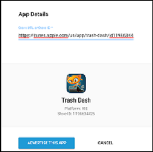
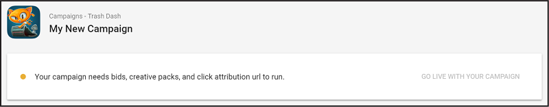

# Introduction to campaigns
## Overview
This documentation helps advertisers acquire users through Unity’s self-serve [ad campaigns dashboard](https://acquire.dashboard.unity3d.com). Use the dashboard to quickly and easily create high-performing advertising campaigns for your apps. 

### Guide contents
* [Creating a Unity developer account](#creating-a-unity-developer-account)
* [Adding apps to the Acquire dashboard](#adding-apps-to-the-dashboard)
* [Creating campaigns](#creating-campaigns)
* [Configuring and optimizing campaigns](#configuring-and-optimizing-campaigns)

## Creating a Unity developer account
To get started, create a Unity ID. If you already have one, skip this step.

1. From the [Unity ID login page](http://id.unity.com), choose to create an account.
2. Follow the instructions to create a user ID and password.
3. Verify your account via email.
4. Navigate to the [Acquire dashboard](https://acquire.dashboard.unity3d.com) to start adding apps and campaigns.

## Adding apps to the dashboard
Once you’ve created and verified your account, you can start adding apps to the [Acquire dashboard](https://acquire.dashboard.unity3d.com): 

1. From the **Campaigns** page, click **ADVERTISE APP** in the top-right corner of the dashboard.
2. When prompted, enter the app’s store URL.
3. Click **ADVERTISE THIS APP** to continue.

## Creating campaigns
To create a new campaign for your app: 

1. Click **CREATE CAMPAIGN**. 
2. Name your campaign. Unity recommends using a format that includes the app name, platform, and targeted region for clarity (for example, "_TrashDash_iOS_Tier1_"). 
3. Select the campaign type. The default type is **CPI**, which focuses on getting more users into your app. For information on **Retention** or **ROAS** campaigns, see documentation on [Audience Pinpointer](AdvertisingOptimizationAudiencePinpointer.md). 
4. Click **Create** to create the campaign.
 

### Campaign status
Upon creating a new campaign, its status appears at the top of the campaign page. Each campaign requires three minimum components to activate: 

* [Creative packs](AdvertisingCampaignsConfiguration.md#creative-packs)
* [Bids](AdvertisingCampaignsConfiguration.md#bids)
* [Attribution links](AdvertisingCampaignsConfiguration.md#tracking-links)

For more information on these settings, see documentation on [configuring campaigns](AdvertisingCampaignsConfiguration.md).

The option to activate your campaign remains disabled until it meets these criteria. Once it does, return to the campaign status section and click **GO LIVE WITH YOUR CAMPAIGN** to activate it.  

**Note:** Your campaign will go live once it has been approved (see documentation on [campaign moderation](AdvertisingResourcesFAQ#has-the-campaign-approval-process-changed-)). If your campaign is live, you will see a **PAUSE CAMPAIGN** button instead. If your campaign is paused, you will see **RESUME CAMPAIGN**.

Change any of your campaign’s settings at any time from the dashboard's **Campaigns** page. Locate your app to view a list of its associated campaigns and their name, remaining budget, and status (**live** or **paused**).  Select the campaign’s **Campaign Name** to edit its settings.

## Configuring and optimizing campaigns
Next, you’ll want to configure the campaign to your liking. The documentation on [Configuring campaigns](AdvertisingCampaignsConfiguration.md) covers the following topics in depth:

* [Creative packs](AdvertisingCampaignsConfiguration.md#creative-packs) 
* [Bids](AdvertisingCampaignsConfiguration.md#bids)
* [Budgets](AdvertisingCampaignsConfiguration.md#budgets)
* [Scheduling](AdvertisingCampaignsConfiguration.md#scheduling)
* [User targeting](AdvertisingCampaignsConfiguration.md#targeting)
* [Attribution tracking links](AdvertisingCampaignsConfiguration.md#tracking-links) 

Finally, review the [best practices guide](AdvertisingOptimizationVideoAdsBestPractices.md) for getting the most out of your campaign designs.

## What's next?
[Configure](AdvertisingCampaignsConfiguration.md) your campaigns to better target users.