# Configuring campaigns
## Overview
This article provides a comprehensive look at each setting for your campaigns. Access campaigns through the [Acquire dashboard](https://acquire.dashboard.unity3d.com).

### Guide contents
* [Creative packs](#creative-packs) 
* [Bids](#bids)
* [Budgets](#budgets)
* [Scheduling](#scheduling)
* [User targeting](#targeting)
* [Attribution tracking links](#attribution-links)

## Creative packs
Creative packs are the content of your ad campaign. You can now assign more than one creative pack to a single campaign. This means you don’t need to create multiple campaigns in order to run additional creative packs for a single ad campaign. Furthermore, multiple campaigns can share the same creative packs, so long as they’re for the same app. 

**Note:** When a campaign contains multiple creative packs, an algorithm determines the optimal one to show for each user. 

### Adding a new creative pack
In the **Creative packs** section of the campaign page, click **CREATE** (or **CREATE CREATIVE PACKS** if none exist yet).

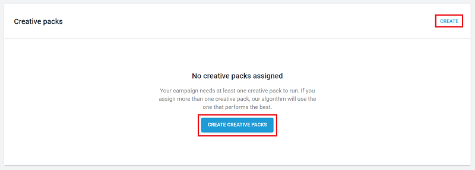

Enter a **creative pack name**, then upload **end card** and **video** assets (detailed below).

For more information on creative pack assets, see documentation on [creative asset specs](AdvertisingResourcesCreativeSpecs.md).

When finished uploading creative assets, click **CREATE**. Your new creative pack now appears in the campaign’s **Creative Packs** list with a **Processing** status. This status indicates that your creative pack is undergoing moderation (see section on **Moderation** below). Click **ASSIGN** to choose which creative packs to include with the campaign. Note that selecting the downward arrow expands the creative pack’s details.

### Moderation
All new creative packs undergo a moderation process when their associated campaigns go live for the first time. Moderation ensures that creatives adhere to Unity's advertising [content policies](https://unity3d.com/legal/advertising-content-policy). During moderation, Unity also age rates content according to app store publisher guidelines. Publishers can [filter the ads](MonetizationResourcesDashboardGuide#ad-filters) that show in their apps based on these ratings. 

You must set a campaign with new creatives to **Live** in order to trigger moderation. If a creative has already been approved for use in other campaigns, it does not need to be moderated again.

**Note:** Campaigns must contain at least one approved creative pack to go live. If your live campaign includes a mix of approved and pending creative packs, the pending ones will automatically run once approved. 

**Important!** Due to the sensitive nature of gambling ads across many of our publishers, Unity requires gambling advertisers to be managed accounts. Gambling creatives from unmanaged partners will be rejected in moderation. To become a managed partner or learn more about Unity's gambling ad policies, please [contact us](mailto:adops-support@unity3d.com). 

## Bids
Unity Ads is a bidding platform. The exposure of your ad campaign depends on its eCPM (effective cost per thousand impressions), which is determined by the CVR (video conversion rate from impression to install) and CPI (cost per install) of your campaign. The higher your campaign’s eCPM, the more exposure it receives. 

### Adding new bids
To add a bid, scroll to the **Bids** section and click **ADD**.

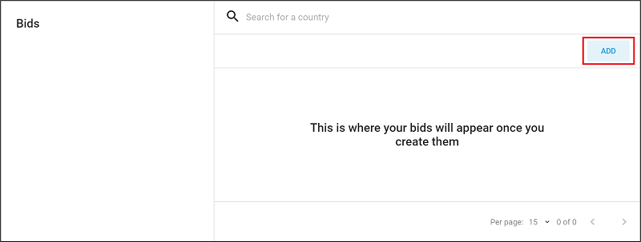

Use the **Search** tool to locate a country, or expand a region from the dropdown list to specify desired bids in each of that region’s countries. Selecting a region adds the default values for every country in that region (you can adjust or exclude these selections later if needed). 

**Note:** Unity provides default values as a baseline, using average bid values for each region. You will likely want to modify them to fit your individual needs, app type, and marketing strategy.

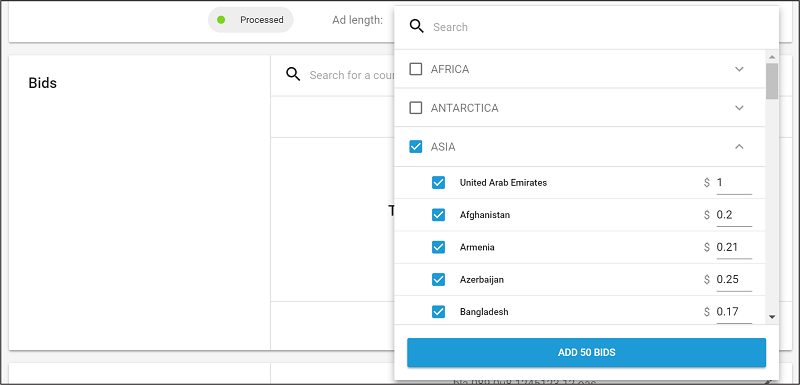

### Editing bids
To edit an existing bid, click **EDIT**, then select the bid(s) to edit. 

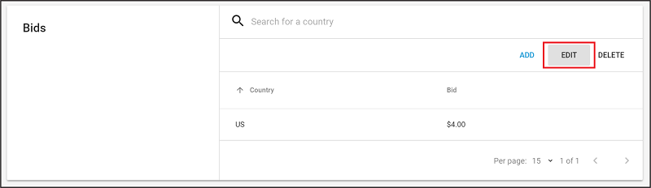

Hover over a bid value to display an edit icon (see image below). Select the edit icon to manually enter a new bid value.

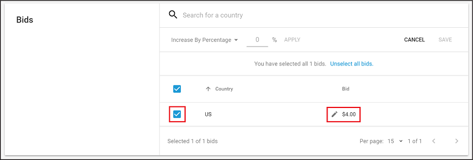

Make bulk edits by selecting the countries or regions to adjust, then selecting the **Increase By Percentage** dropdown to select from the following operations:

* **Increase By Percentage**: increases all selected bids by the specified % (for example, if the value is 25%, a $4.00 bid becomes a $5.00 bid). 
* **Decrease By Percentage**: decreases all selected bids by the specified % (for example, if the value is 25%, a $4.00 bid becomes a $3.00 bid).
* **Increase By Value**: increases all selected bids by the specified dollar value (for example, if the value is 1, a $4.00 bid becomes a $5.00 bid).
* **Decrease By Value**: decreases all selected bids by the specified dollar value (for example, if the value is 1, a $4.00 bid becomes a $3.00 bid).
* **Change To Value**: sets all selected bids to the specified dollar value (for example, if the value is 1, a $4.00 bid becomes a $1.00 bid).

Enter the new value, then click **APPLY** to process the operation to all selected bids.

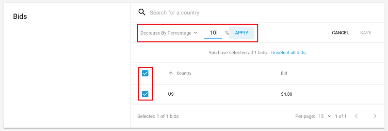

Click **SAVE** to apply changes.

### Deleting bids
To delete an existing bid, click **DELETE**, then select the bid(s) to delete. Select bids using the **Search** tool, by country, or in bulk by region. 

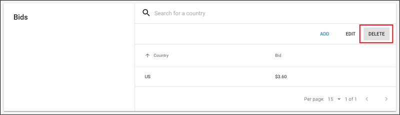

Affected bids display strikethrough font. Click **DELETE** to confirm their removal.

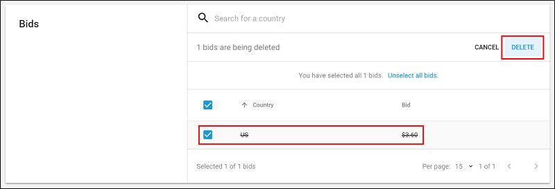

### Source Bidding 
Source bidding allows you to granulary target and price apps (sources) within your ad campaign to bid higher or lower on individual sources per geo.

Source bidding gives you the self-service tools to granularly bid against source IDs on a per-country basis. Each source is valued differently based on its geos and quality of users. The ability to bid on sources accordingly, instead of placing a single bid across all sources within a given geo, creates greater efficiency within your ad spend.

* **Granular optimization**: Instead of applying the same price across all sources within a geo or larger app targeting list, make intelligent optimizations with granular bids for individual sources in each geo.
* **Flexibility and targeting control**: Increase control of how much you spend per source, and the flexibility to make changes.
* **Self-service**: It’s easy to set up and optimize campaigns on the dashboard without specialized support. 

#### How it works 
Each source app has an associated ID. Source bidding lets you place bids against the source IDs you want to target, per country, by modifying and uploading a spreadsheet in the [Acquire dashboard](https://acquire.dashboard.unity3d.com/).

#### Source bid strategy 
To determine which sources to isolate and target, Unity suggests starting with static CPI campaigns. Use the data from these initial campaigns to analyze the various sources driving traffic, and determine more granular bids based on your own individual return on ad spend (ROAS) and lifetime value (LTV) goals.

Use source bidding as a standalone campaign strategy, or as an additional targeting tactic alongside standard bids. If the **Source Bids** and **Countries & Bids** sections target the same Source ID(s), the source bids receive priority. You may also target geos in **Source Bids** that are not targeted in **Countries & Bids**.

#### Creating source bids
To start using source bids, follow these steps:

1. Log in to the [Acquire dashboard](https://acquire.dashboard.unity3d.com/).
2. Select **Campaigns** from the left navigation bar.
3. Select the campaign you wish to work with, or [create a new campaign](AdvertisingCampaigns.md#creating-campaigns).
4. On the campaign menu, navigate to the **Source bids** section, then click **Export** template.
5. After exporting the template, populate the spreadsheet, as described in the [next section](#source-bid-templates).
6. Return to the **Source bids** section of the campaign menu, then click **Import** to upload your modified spreadsheet.

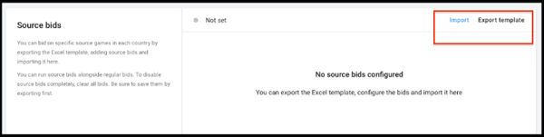

Once you have successfully imported your configuration, the **Source bids** section will display a list view of the countries you are targeting, and the bid amounts imported from your spreadsheet. A green icon indicates that source bidding is enabled and active.

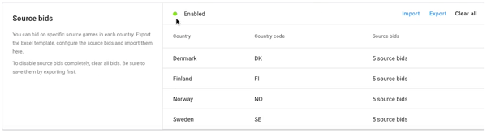 

Select **Clear all** to clear any imported bids and disable source bidding for the campaign. Alternatively, you can [pause or stop the campaign](AdvertisingCampaigns.md#campaign-status).

**Note**: If this section remains disabled after uploading your spreadsheet, refer to the [errors](#errors) section below. 

#### Source bid templates
To specify your source bids, open the exported template and populate the fields according to the following guidelines: 

| **Column** | **Description** | **Example values** |
| ---------- | --------------- | ------------------ |
| `Country code` | The two-letter (Alpha 2) [ISO country code](https://www.nationsonline.org/oneworld/country_code_list.htm) representing the source’s geo.  **Note**: Using three-letter country codes will cause an error. | <ul><li>`US`</li><li>`CA`</li><li>`KR`</li></ul> |
| `Source ID` | The Unity Ads identifier for the source app. | `1234567` |
| `Bid` | The amount you are willing to spend, in U.S. currency. This field supports up to two decimal places.  **Note**: Values with three or more decimals will cause an error. | <ul><li>`5`</li><li>`5.1`</li><li>`5.12`</li></ul> |

The finished spreadsheet might look like this:

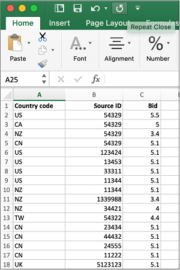 

**Important**: Make sure to save the template as an `xlsx` file.

**Note**: If you’ve already entered standard bids in the **Countries & Bids** section, those bids act as default bids for any sources that are not explicitly defined in your spreadsheet. You may also run a campaign that consists exclusively of source bids. 

#### Errors
Any errors when importing your spreadsheet are detailed on the **Source bids** section of the campaign menu.

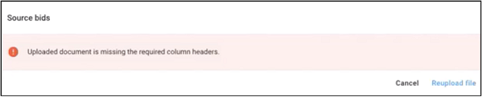 

Some examples of potential errors include:

* Missing column headers
* Blank values
* Incorrect values (such as three-character country codes, or bids with the wrong number of decimal places)
* Unpopulated fields from a row

If there are multiple errors, you will see a detailed explanation of all of them:

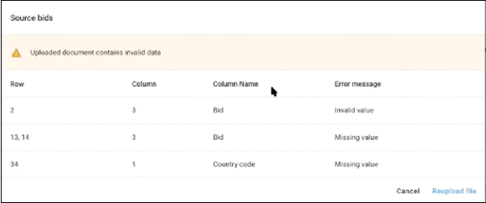 

Fix the issues in your spreadsheet, and re-import the file.

#### Updating source bids
To update source bids, revise your spreadsheet and re-import it. As a validation check, your previous bids will appear crossed out. 

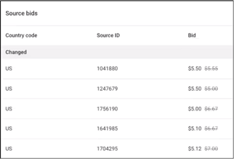 
 
For additional validation, an alert will appear if a bid changed by a substantial amount.

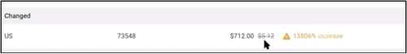 

#### App targeting and source bidding 
[Whitelisting](#whitelisting) and source bidding are separate campaign targeting tactics. You must clear any whitelisted apps from a campaign in order to use source bids in that campaign. You can still use app blocking ([blacklisting](#blacklisting)) in tandem with source bidding.

## Campaign details
Edit the campaign **Name** and **Bid type**. Currently the only supported bid type is **CPI** (cost per install). 

## Budgets
Your campaign budget dictates how much marketing spend the campaign could consume. The default value is **unlimited**. To specify a budget limit, select the edit icon, then check **Limit campaign budget**. You can either select an existing budget or create a new one.

### Creating a new budget
Select the **Choose budget** dropdown, then select **ADD BUDGET**.

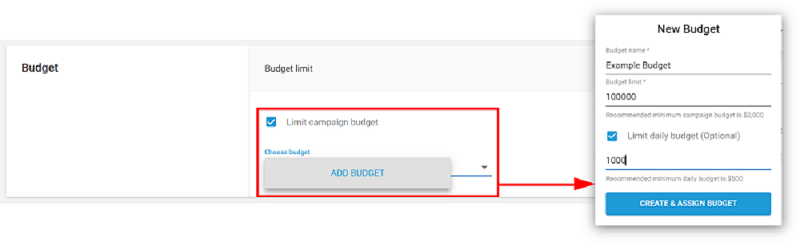

Next, enter the **Budget name** and total **Budget Limit**. If you want to limit the amount per day, check **Limit daily budget** and enter the desired amount. 

### Editing Budgets
Select the edit icon, then select the budget to edit from the **Choose budget** dropdown. Click **EDIT BUDGET** to display the budget editing interface.

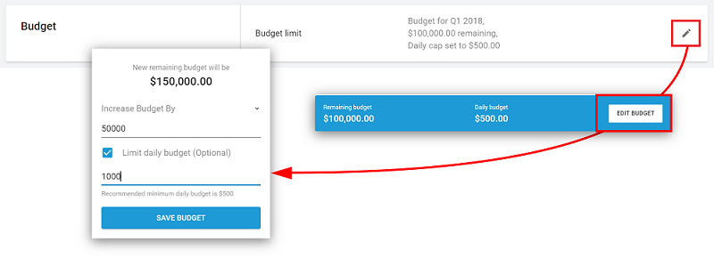

Choose whether to **Increase budget by** or **Decrease budget by** the dollar value entered. The resulting remaining budget appears when you enter a value. Click **SAVE BUDGET** to apply your changes.

**Note:** Since multiple campaigns can draw from the same budget, remember that your changes may impact other campaigns.

## Scheduling
Specify the start and end date parameters for your campaign to run. All dates begin at midnight UTC.

### Runs from 
Defines the start date of the campaign. The default value is the current date. Select the edit icon to specify a different date.

**Note:** Regardless of this date, a campaign must be set to live and meet the necessary criteria in order to run. 

### Runs until 
Defines the end date of the campaign. The default value is Not set (the campaign will run indefinitely, or until out of budget or paused). Select the edit icon to specify a different date.

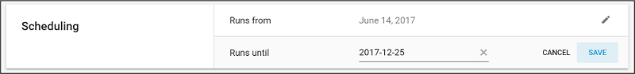

## App Targeting
Use Source IDs to whitelist or blacklist apps to bid on. For more information on acquiring Source IDs, see section on [creating source bids](#creating-source-bids).

### Whitelisting
Adding Source IDs to your whitelist restricts bidding to those specified apps. Note that limiting sources limits the scale of your campaign, so restricting your whitelist too much can negatively impact the campaign's performance.

### Blacklisting
Adding Source IDs to your blacklist excludes those specified apps from receiving bids.

## Device Targeting
Use this section to refine your targeted devices. You only bid for users that fit specified criteria.

### Internet Connection
Select the edit icon, then check all desired options (**wifi** or **cellular**). We recommend selecting both to broaden the reach of your campaign. Click **SAVE** to apply your preferences. 

### Operating System
Select the edit icon, then select a **Minimum OS version** and a **Maximum OS version** from the dropdowns to define the OS range (note that the platform associated with your app’s store URL determines the list of operating systems). Click **SAVE** to apply your preferences.

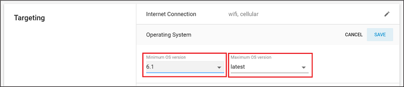

### Device (Apple only)
Select the edit icon, then check all desired iOS devices. Click **SAVE** to apply your preferences.

### Screen Size (Google only)
Select the edit icon, then check all desired options:

* **small** (at least 426 x 320 pixels)
* **normal** (at least 470 x 320 pixels)
* **large** (at least 640 x 480 pixels)
* **xlarge** (at least 960 x 720 pixels)

Click **SAVE** to apply your preferences.

### Screen Density (Google only)
Select the edit icon, then check all desired options:

* **Ldpi** (120dpi)
* **mdpi** (160dpi)
* **hdpi** (240dpi)
* **xhdpi** (320dpi)
* **xxhdpi** (480dpi)
* **xxxhdpi** (640dpi)
 
Click **SAVE** to apply your preferences.

## Attribution links
Three events can measure user interactions with your video ad campaign:

* Starts (Impressions)
* Completed views
* Clicks

To accurately report these events, you must [obtain attribution tracking links](https://unityads.unity3d.com/help/advertising/s2s-install-tracking) from a 3rd-party or in-house attribution service, then set them in your campaign configuration on the Acquire dashboard. 

In the campaign configuration menu, scroll to the **Attribution links** section and click the edit icon to set the URLs for each field.

| **Setting** | **Description** | **Requirement** |
| ----------- | --------------- | ------------ |
| `Start (Impression)` | Fired when players start viewing the video. The start link executes right before the ad begins to play, helping you measure reach. |  Recommended |
| `Completed view` |Fired when players finish watching the video.  **Note**: This field is hidden by default. To display it, click **Show advanced**.| Optional |
| `Click` | Fired when the player clicks the download button. | Required |

**Note:** Campaigns require a **Click** attribution link. However, Unity recommends assigning **Start (Impression)** and **Completed view** attribution links as well. Tracking these events will help you compare campaign performances. 

### URL formatting requirements
All attribution links must comply with the following requirements, or the attribution will not work correctly:

* URLs and redirects must use HTTPS.
* URLs must contain at least the `{ifa}` dynamic custom token.
* HTTP redirects should be done via HTTP 3XX codes and not via HTML/Javascript.
* URLs cannot redirect to the Apple app store or Google Play store.

When you save the attribution link, the dashboard checks for errors to validate that the URL is syntactically correct. 

### Troubleshooting
#### Problem
You see a zero conversion rate, because Unity stops delivering a campaign, or the attribution partner reporting doesn’t show starts, views, or installs.

#### Cause 
Even if a URL passes validation, it might still be incorrect due to a typographical error or other issue. 

#### Solution
Try the following:

* Check the attributions links carefully and correct typographical errors.
* Ensure that the attribution links follow the URL formatting rules listed above. 
* Verify that each attribution link is in the correct field (for example, a start attribution link is not in the **Click** field). 
