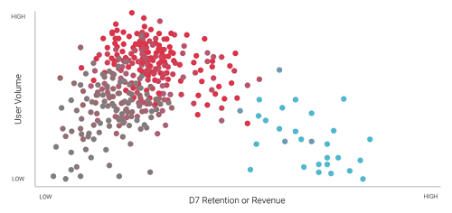
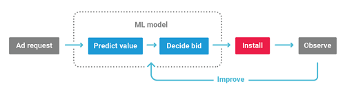
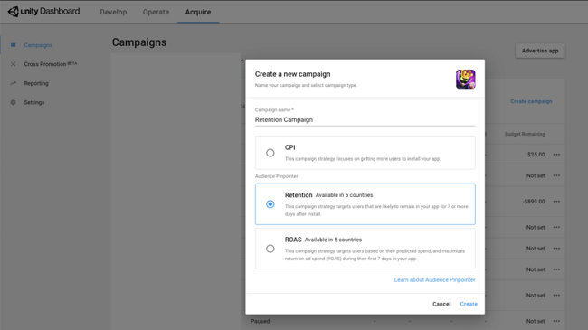
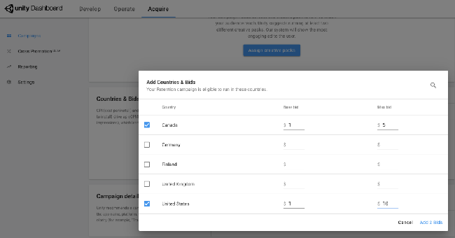
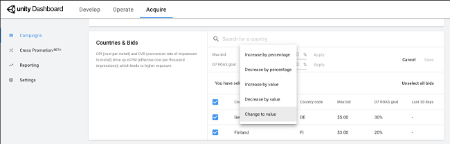

# Audience Pinpointer  
## Overview
Audience Pinpointer is a powerful user acquisition service that uses machine learning to help you find the players most likely to have value beyond the app install. Using dynamic pricing, Audience Pinpointer allows you to bid more for predicted high-value users and less for easy to find users.

### How it works
Unity’s machine-learning model utilizes real-time valuation of the user at the point of an ad request. The algorithm decides on a bid for each user based on individual valuation. The system updates constantly based on actual user behavior and the preferences of millions of users across Unity’s platform.

Audience Pinpointer offers two models to choose from:

* [**Retention**](#optimizing-for-retention): Optimize for retention to acquire users who are more likely to play your game for 7 or more days.
* [**ROAS**](#optimizing-for-revenue): Optimize for revenue to acquire users based on their predicted spend and maximize return on ad spend (ROAS) during their first 7 days in your game.

#### Optimizing for retention
This campaign strategy targets users that are likely to remain in your game 7 days after install. Audience Pinpointer uses dynamic pricing so you can pay the right price across the entire user base. This approach has proven to be most successful for games that mainly monetize from ads.

For example:

* Your game’s median D7 Retention is 10%.
* Potential User 1's predicted D7 Retention for your game is 20%, or twice the median.
    * The bid for Potential User 1 is base CPI x2
* Potential User 2's predicted D7 Retention for your game is 5%, or half the median.
    * The bid for Potential User 2 is base CPI x0.5.

#### Optimizing for revenue
This campaign strategy targets users that are predicted to spend, and uses dynamic bids to acquire them at the right price. Revenue optimization campaigns help you achieve your return on ad spend (ROAS) goals, which is expressed as the revenue a player generates in their first 7 days playing your game, divided by your cost to acquire them.

For maximum impact, Unity recommends running revenue-optimized campaigns alongside retention-optimized campaigns and standard CPI campaigns that optimize towards the best install conversion rates.

For example:

* Your target 7-day ROAS is 10%, meaning a user should spend 10% of the amount you bid to acquire them during their first 7 days in the game.
* Your maximum CPI bid is $20.
* Audience Pinpointer predicts Potential User 1 will generate $1 of revenue during their first 7 days in the game. 
    * The CPI bid for Potential User 1 is $10 ($1 / 0.1 = $10, which is within your maximum bid range).
* Audience Pinpointer predicts Potential User 2 will generate $5 of revenue during their first 7 days in the game.
    * The CPI bid for Potential User 2 is $20 ($5 / 0.1 = $50, which exceeds the $20 maximum bid cap).

## Getting started
Dynamic Audience Pinpointer campaigns work very well alongside standard ones, because they each look at different levels of data to optimize. Implement Audience Pinpointer campaigns in three basic steps:

1. Enable the passing of post-install session and purchase events to Unity.
2. Unity confirms ingestion and validation of events.
3. Configure a retention or ROAS campaign in the [Acquire dashboard](https://acquire.dashboard.unity3d.com/).

### Passing post-install events
Audience Pinpointer requires you to pass post-install session events (indicating retention) and in-app purchase events, which allows Unity to dynamically find the right users. For instructions on how to do this, see documentation on [passing post-install events to Unity](AdvertisingOptimizationAudiencePinpointer.md#required-audience-pinpointer-event-parameters).

After Unity validates your post-install events, you will be able to create Audience Pinpointer campaigns in the dashboard.

### Creating Audience Pinpointer campaigns
To create a new Audience Pinpointer campaign:

1. From the [Acquire dashboard](https://acquire.dashboard.unity3d.com/), navigate to the game you want to advertise and click **Create campaign**.
2. In the campaign creation dialogue, give the campaign a name, then select **Retention** or **ROAS**.

**Note**: If Unity has not validated post-install event data for your game, these options will be unavailable.

### Configuring campaign parameters
Scroll to the **Countries and Bids** section of the campaign configuration menu to view eligible countries to target for retention. Click **Adjust** to edit the parameters of each geo. 

#### Retention campaigns
Specify **Base** and **Max** bids for each geo you want to target. The base bid is the CPI you are willing to pay for the average user eligible for this campaign, and the max bid is the highest CPI you are willing to pay for a user who is likely to stay in your game. The bidding algorithm uses this information to dynamically set your bid for each user based on their predicted retention. While the bid may fluctuate slightly above our below the base bid, it will never exceed the max bid. 

You can edit these values individually, or check multiple geos to execute bulk changes (increase or decrease by value, increase or decrease by percent, or set to a value).

For more information, see section on [optimizing for retention](#optimizing-for-retention). 

#### Revenue campaigns
Specify the **D7 ROAS goal** and your **Max** bid for each geo you want to target. The **D7 ROAS goal** is a realistic return on ad spend (%) you’d like to see for a new user after 7 days in your game, while the **Max** bid is the absolute most you are willing to spend to acquire a high-quality user. You can edit these values individually, or check multiple geos to execute bulk changes (increase or decrease by value, increase or decrease by percent, or set to a value).

**Tip**: Base your D7 ROAS goal on a gross revenue figure to achieve realistic RAS performance with Audience Pinpointer. 

Audience Pinpointer calculates bids based on estimated user value and your day-7 ROAS goal. Nothing changes on the reporting side, as you still get the CPI value per user for each install. You will not pay for the install until it takes place. 

#### Setting ROAS targets and max CPI
Look at the 7-day ROAS you’ve historically achieved with similar static CPI campaigns. The ROAS target should be similar to what you’ve observed so far. If you set the target too high, unrealistic user criteria may limit scale and lead to reduced traffic. In general, the higher your ROAS target, the lower your CPI bids, so setting extremely high ROAS targets yields very low CPI bids that are unlikely to win many impressions. Similarly, because Audience Pinpointer dynamically prices bids based on predicted value, setting low maximum CPI bids can cause you to miss out on high-value users. Low CPI caps typically yield less installs and lower value installs.

Audience Pinpointer predicts 7-day retention and ROAS, so allow at least a full week or two using the provided guidelines to let the data mature before adjusting the target up or down based on campaign performance.

**Note**: Unity has lowered the data requirements threshold to create an Audience Pinpointer campaign. While lowering these data limits enables you to start and expand these campaigns faster, new campaigns and new geos still require time to mature and collect more data to improve their prediction accuracy. For new campaigns or eligible geos, Unity recommends starting with a lower max CPI and observing performance before increasing it.

You will also be able to view suggested D7 ROAS goals based on the last 30 days from all campaigns of this storeId. Lastly, you will be able to view the D7 ROAS Last 30 Days which is the GEO-specific D7 ROAS of the past 30 days for that campaign under the campaign-view.

### Whitelists and Blacklists
Note that Unity recommends that you clear any whitelisted or blacklisted games for dynamic campaigns, as they are purely optimized towards users. This is considered a best practice, but you may speak to your Unity representative if you wish to retain these lists for your dynamic campaign(s).
