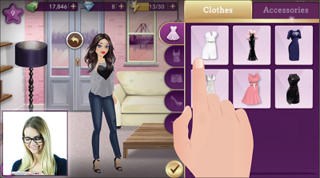
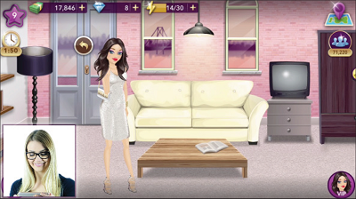
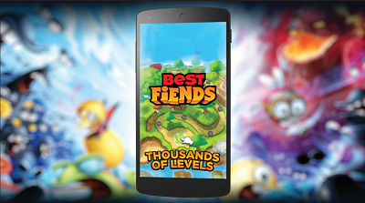
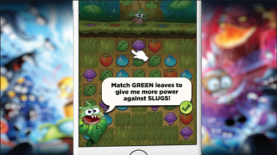

# Video advertisement best practices  
These best practices are compiled from the Unity Ads network, based on proven success for rewarded video. We encourage you to review them and run multiple content types simultaneously to drive the best engagement and reach the widest possible audience. Additionally, once your videos are live, Unity Ads’ machine-learning algorithm evaluates which videos are most appropriate and engaging for each user and optimizes for them to drive the best results.

### Aim for authenticity  
Give the user an idea of the real app experience instead of focusing on cutscenes or marketing assets (although a balanced mix of these can be very effective). It helps user retention if the app experience is what was expected after seeing the trailer.

### Use eye-catching indicators  
Adding hand interaction or touch indicators can help  make the content more understandable. Experiment  with different styles (live action hands, animated hands, hot spot indicator etc).

### Draw attention with innovation 
Make your video ad stand out by experimenting with different creatives. For example, showcase a real commentator in the ad or create a fictional character with a memorable and engaging storyline.

### Show, don't tell 
In general, the more you can show instead of tell, the better. However, using text elements can be a very powerful way to make your point quickly and highlight the unique features of your app.

### Test different lengths 
Shorter videos tend to drive higher engagement and video completion rates. As a best practice, advertisers should keep the length between 10 and 30 seconds. Front load your video with the best content to keep users engaged. To depict more complex gameplay, you might need longer videos, whereas casual apps may require shorter creative. We recommend testing different lengths because they can drive different metrics. For example, while one creative may drive higher video completion rates, the other may drive better lifetime value (LTV). You should iterate on the creative that meets your campaign goals.

### Create portrait and landscape versions 
Try to provide a video for both landscape and portrait orientations for each campaign. Repurposing content from one orientation to the other can be tricky though.  Do your best to keep the experience about the same in both orientations.

### Consider showing a device 
If you need to show portrait footage in a landscape video or vice versa, embedding the footage on a device screen can be a visually pleasing way to do it, and it also lets you re-frame content in a convincing way. Using devices definitely gives you more design options but sometimes all you need is some full-screen action without any distracting elements. Test to see what works best to showcase your app.

### Guide the player’s eye 
Know exactly what you want the user to focus on and animate accordingly.

### Pace it for clarity and excitement 
Keep the pacing exciting but make sure players have time to understand the content. Clarity is often the most important element. Focus on one message at a time, and use text elements to support the visuals – don’t mention something that is not currently happening on the screen.

### Edit to the beat 
Many users choose to watch trailers without sound but when they do, tightly cutting footage to music helps it hit harder. Use music from the app if possible. Add sound effects for emphasis, but keep them subtle, and preferably use sounds from the app too.

### Match the soundtrack   
Try to create a story with the soundtrack that has a beginning, a middle and an end. A cohesive soundtrack works better than just a random song that fades out. Use the soundtrack to set the length of the trailer. 

### Show your stars 
If there are prominent characters or famous actors for example in your app, show them.

### Localize your content 
Reach users in their own language. Chinese and Russian are good languages to start experimenting with.

### Promote special events 
Consider creating new trailers showcasing special events, new levels, seasonal events etc.

### Hype your launches 
If there is any kind of hype around your release, show it.