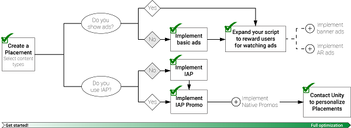

# Unity Monetization
Created by the leading mobile game engine, the Unity Ads SDK provides a comprehensive monetization framework for your game, whether you develop in Unity, XCode, or Android Studio. It streamlines ads, in-app purchasing, and analytics, using cutting-edge machine learning to maximize your revenue while maintaining a great player experience. Getting started is simple.

This page illustrates the journey towards maximizing your revenue with Unity Ads. Follow step by step, or jump to the integration step that best fits your stage of development.

## Preparation
New to Unity Ads? Take care of these basics before implementation:

1. Download and import the latest Unity Ads Asset package or SDK: [Unity (C#)](https://assetstore.unity.com/packages/add-ons/services/unity-ads-66123) | [iOS (Objective-C)](https://github.com/Unity-Technologies/unity-ads-ios/releases) | [Android (Java)](https://github.com/Unity-Technologies/unity-ads-android/releases)
2. [Register](https://id.unity.com/) a Unity developer account on the developer dashboard.
3. Use the [developer dashboard](https://operate.dashboard.unity3d.com) to configure [Placements](MonetizationPlacements.md) for monetization content. 
4. Review our [best practices guide](MonetizationResourcesBestPracticesAds.md), complete with case studies, to better understand your monetization strategy before diving in.

## Implementation
Integration may vary, depending on your development platform.

1. Integrate Unity Ads using the `Advertisements` API: [Unity (C#)](MonetizationBasicIntegrationUnity.md) | [iOS (Objective-C)](MonetizationBasicIntegrationIos.md) | [Android (Java)](MonetizationBasicIntegrationAndroid.md)
2. Expand your basic ads integration: 
  * Reward players for watching ads: [Unity (C#)](MonetizationBasicIntegrationUnity.md#implementing-rewarded-ads) | [iOS (Objective-C)](MonetizationBasicIntegrationIos.md#implementing-rewarded-ads) | [Android (Java)](MonetizationBasicIntegrationAndroid.md#implementing-rewarded-ads)
  * Incorporate banner ads: [Unity (C#)](MonetizationBannerAdsUnity.md) | [iOS (Objective-C)](MonetizationBannerAdsIos.md) | [Android (Java)](MonetizationBannerAdsAndroid.md)
  * Incorporate augmented reality (AR) ads: [Unity (C#)](MonetizationArAdsUnity.md) | [iOS (Objective-C)](MonetizationArAdsIos.md) | [Android (Java)](MonetizationArAdsAndroid.md)
3. If your game uses in-app purchasing, integrate [IAP Promo](https://docs.unity3d.com/Manual/IAPPromo.html):
  * If you use Unity IAP: [Unity (C#) ](https://docs.unity3d.com/Manual/IAPPromoIntegration.html)
  * If you use a custom IAP implementation: [Unity (C#)](MonetizationPurchasingIntegrationUnity.md) | [iOS (Objective-C)](MonetizationPurchasingIntegrationIos.md) | [Android (Java)](MonetizationPurchasingIntegrationAndroid.md)
  * iOS and Android developers can optionally customize Promo assets: [iOS (Objective-C)](MonetizationNativePromoIos.md) | [Android (Java)](MonetizationNativePromoAndroid.md)
4. Convert your Ads and Promo Placements into Personalized Placements to optimize monetization with machine learning: [Unity (C#)](MonetizationPersonalizedPlacementsUnity.md) | [iOS (Objective-C)](MonetizationPersonalizedPlacementsIos.md) | [Android (Java)](MonetizationPersonalizedPlacementsAndroid.md)

## Manage, analyze, optimize
Beyond implementation, Unity empowers you to fine-tune your strategy:

* The Unity [developer dashboard](https://operate.dashboard.unity3d.com/) allows you to [manage your ads implementation](MonetizationResourcesDashboardGuide.md). Use the dashboard's [robust metrics tools](MonetizationResourcesStatistics.md) to adopt a data-driven approach to fine-tuning your monetization strategy.
* Learn how to [filter your ads](MonetizationResourcesDashboardGuide.md#ad-content-filters) to target your audience.
* Don’t miss out on revenue; be sure to [add your Store Details](MonetizationResourcesDashboardGuide.md#platforms) once your game is live.
* Implement Standard Events to help Unity’s machine learning model optimize monetization based on your game’s economy. [Unity (C#)](MonetizationPersonalizedPlacementsUnity.md#implementing-standard-events) | [iOS (Objective-C)](MonetizationPersonalizedPlacementsIos.md#implementing-standard-events) | [Android (Java)](MonetizationPersonalizedPlacementsAndroid.md#implementing-standard-events)
* Sign up for [automated payouts](MonetizationResourcesRevenueAndPayment.md#automated-payouts).

## Support
Have questions? We're here to help! The following resources can assist in addressing your issue:

* Browse the Unity Ads [community forums](https://forum.unity.com/forums/unity-ads.67/).
* Search the Unity Ads [monetization Knowledge Base](https://support.unity3d.com/hc/en-us/sections/201163835-Ads-Publishers).
* [Contact Unity Ads support](mailto:unityads-support@unity3d.com) with your inquiry.