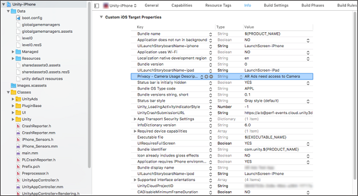

# AR ads for iOS developers
## Overview
This guide covers implementation for AR ads in your iOS game.

* If you are a Unity developer using C#, [click here](MonetizationArAdsUnity.md). 
* If you are an Android developer using Java, [click here](MonetizationArAdsAndroid.md). 
* [Click here](MonetizationResourcesApiIos.md#unityads) for the Objective-C `UnityAds` API reference.

### Guide contents
Implementation consists of four major steps:

1. [Configure your Project for Unity Ads](#configuring-your-game-for-unity-ads).
2. [Configure your Project to access the device's camera permission settings](#setting-camera-permissions).
3. [Create a Placement and associated script to receive and display AR content](#implementation).
4. [Contact the Unity Ads team to enable AR ads for your Project](#enabling-ar-content-through-unity).

## Configuring your Project for Unity Ads
To implement AR ads, you must integrate Unity Ads in your game. To do so, follow the steps in the [basic ads integration guide](MonetizationBasicIntegrationIos.md) that detail the following:

* [Creating a Project in the Unity developer dashboard](MonetizationBasicIntegrationIos.md#creating-a-project-in-the-unity-developer-dashboard)
* [Importing the Unity Ads framework](MonetizationBasicIntegrationIos.md#importing-the-unity-ads-framework)
* [Initializing the SDK](MonetizationBasicIntegrationIos.md#initializing-the-sdk)

Once your game is configured for Unity Ads, proceed to configuring the camera permission settings.

## Setting camera permissions
AR ads require access to the device’s camera. You can configure the Unity Ads SDK to handle this permission query.

Add the **Privacy - Camera Usage Description** key to your game's [Property List](https://developer.apple.com/library/archive/documentation/General/Reference/InfoPlistKeyReference/Articles/AboutInformationPropertyListFiles.html) (*Info.plist*). For example, you can set the string value to `"AR ads would like to access the camera"`. 



## Implementation
### Creating a dedicated AR Placement
[Placements](MonetizationPlacements.md) are triggered events within your game that display monetization content. Manage Placements from the **Operate** tab of the [Developer Dashboard](https://operate.dashboard.unity3d.com/) by selecting your Project, then selecting **Monetization** > **Placements** from the left navigation bar. The dashboard does not currently support enabling AR content. Instead, configure a Placement that you will not use for other content, using an easily identifiable Placement ID (for example, `‘arPlacement’`). In the final setup step, you will [contact Unity to enable AR content](#enabling-ar-content-through-unity) for that Placement.

Click the **ADD PLACEMENT** button to bring up the Placement creation prompt. Name your Placement and select the desired type.

### Modifying your Placement script
Follow the steps in the basic integration guide for [initializing the SDK](MonetizationBasicIntegrationIos.md#initializing-the-sdk). You must intialize Unity Ads before displaying a banner ad.

In the script for your dedicated AR Placement, implement the following logic:

* Check for available AR content to fill your dedicated AR Placement.
    * If yes, show content from the AR Placement.
    * If no, show ad or Promo content from another Placement.

#### Script examples
The following example uses the [`UnityAds`](MonetizationResourcesApiIos.md#unityads) API (recommended) to show an AR ad:

```
if ([UnityAds isReady: @"arPlacement"]) {
    [UnityAds show: self placementId: @"arPlacement"];
} else if ([UnityAds isReady: @"video"]) {
    [UnityAds show: self placementId: @"video"];
}
```

Alternatively, the following example uses the [`UnityMonetization`](MonetizationResourcesApiIos.md#unitymonetization) API to retrieve a `UMONPlacementContent` object and show an AR ad. The code should be implemented as a delegate class for the [`UMONShowAdDelegate`](MonetizationResourcesApiIos.md#umonshowaddelegate) delegate.

```
-(void) showAdIfReady: {
    UMONShowAdPlacementContent * arPlacement = (UMONShowAdPlacementContent *) [UnityMonetization getPlacementContent: @"arPlacement"];
    if ([arPlacement isReady]) {
        [arPlacement show: self withDelegate: self];
    } else {
        UMONShowAdPlacementContent * interstitialPlacement = (UMONShowAdPlacementContent *) [UnityMonetization getPlacementContent: @"video"];
        if ([interstitialPlacement isReady]) {
            [interstitialPlacement show: self withDelegate: self];
        }
    }
}
```

Unity recommends reviewing the complete documentation for [basic ads integration](MonetizationBasicIntegrationIos.md) to better understand the methods used in these examples, including callback handlers.

**Note**: If your script already decides between multiple Placements, ensure that the dedicated AR Placement handling executes first.

### (Optional) Adjust surface tracking
Depending on the user's behavior while engaged with AR ad content, your game's surface tracking may be off. This can result in objects floating in mid-air or inside surfaces. As such, we recommend adding a custom handler for AR ads.

### Rebuild your game
Your game should now be ready to receive AR content upon enabling it (see below).

## Enabling AR content through Unity
[Contact](mailto:ads-ar-support@unity3d.com) Unity to enable AR content, providing the following information:

* Your __Project ID__
* The __Placement ID__ for your dedicated AR Placement 

## Testing
Please note that because AR content is loaded directly from our servers, AR ads only work in production mode, not test mode. The AR campaigns for integration testing may not reflect the final quality of the AR content. 

For testing purposes, use the following Game ID and Placement ID combinations:

| Platform  | Game ID | Placement ID |
| --------- | ------- | ------------ |
| **iOS**  | `1234567`  | `arPlacement` |
| **Android**  | `7654321`  | `arPlacement` |

Remember to revert the test __Game ID__ and __Placement IDs__ to real production IDs before publishing your game.

## What's next? 
View documentation for [Personalized Placements](MonetizationPersonalizedPlacementsIos.md) to let machine learning power your monetization strategy.