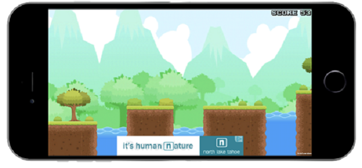
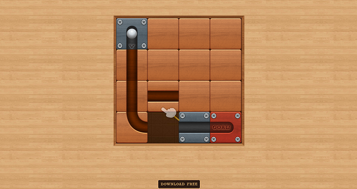

# Monetization content types
## Overview
Unity’s [Personalized Placements](MonetizationPersonalizedPlacements.md) optimize revenue by intelligently serving a mix of engaging content to the right player at the right time. Get to know the various content types, and learn how to deploy them in your monetization strategy.   

## Display ads
[Display ads](MonetizationBasicIntegration.md) are the basic full-screen interstitials that persist until the player dismisses them. These are most effectively implemented strategically at natural pauses or breaks in gameplay, such as a load or level change.

#### Get started with display ads
* [Implement interstitial ads (Unity developers)](MonetizationBasicIntegrationUnity.md)
* [Implement interstitial ads (iOS developers)](MonetizationBasicIntegrationIos.md)
* [Implement interstitial ads (Android developers)](MonetizationBasicIntegrationAndroid.md)
* [Read about best practices for ad implementation](MonetizationResourcesBestPracticesAds.md)

## Video ads
[Video ads](MonetizationBasicIntegration.md) are the most common form of advertising, and recommended in our best practices guide. They create opportunities to implement rewarded ads, where players receive incentives for viewing the ad in its entirety. 

#### Get started with video ads
* [Implement video ads (Unity developers)](MonetizationBasicIntegrationUnity.md)
* [Implement video ads (iOS developers)](MonetizationBasicIntegrationIos.md)
* [Implement video ads (Android developers)](MonetizationBasicIntegrationAndroid.md)
* [Read about best practices for ad implementation](MonetizationResourcesBestPracticesAds.md)

## Augmented Reality (AR) ads
[AR ads](MonetizationArAds.md) offer players a fully immersive and interactive experience, by incorporating digital content directly into their physical world. Players can make new, memorable experiences, while feeling a sense of agency by creating their own narratives.

#### Get started with AR ads
* [Implement AR ads (Unity developers)](MonetizationArAdsUnity.md)
* [Implement AR ads (iOS developers)](MonetizationArAdsIos.md)
* [Implement AR ads (Android developers)](MonetizationArAdsAndroid.md)

## Banner ads
[Banner ads](MonetizationBannerAds.md) remain a consistent source of ad revenue within mobile ad spend. Unity Ads now supports Banner Placements for all publishers looking to integrate them into their games. 

#### Get started with banner ads
* [Implement Banner ads (Unity developers)](MonetizationBannerAdsUnity.md)
* [Implement Banner ads (iOS developers)](MonetizationBannerAdsIos.md)
* [Implement Banner ads (Android developers)](MonetizationBannerAdsAndroid.md)

## Playable ads
Playable ads are ad units that enable the player to engage with the ad content through interaction. You can implement Playable ads through both rewarded and non-rewarded Placements.

#### Get started with Playables
[Implement Unity Ads](MonetizationBasicIntegration.md) in your game to get access to Unity's entire inventory of playable ad content.