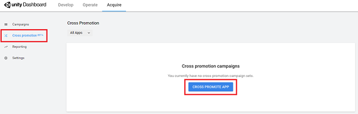
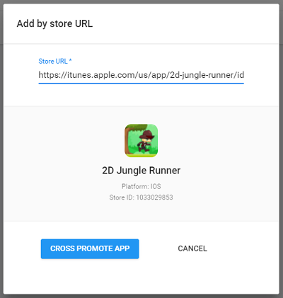
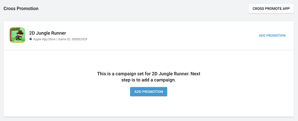
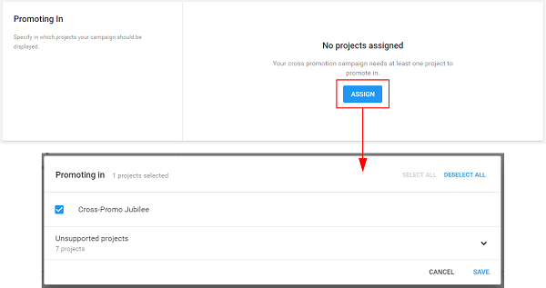
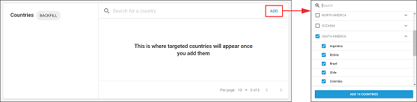

# Cross-Promotions (beta)
## Overview
Cross-Promotion is an open beta feature that allows publishers to backfill their ad Placements with promotions for their own games. A Cross-Promotion works just like regular advertisements, but drives traffic to your own apps. There are several advantages to using them:

* Introduce users to your other apps.
* There is no opportunity cost, because Cross-Promotions only appear when there are no other ads available to fill.
* Boost your impressions and ad requests, which can lead to additional installs.

### Guide contents
* [Starting a campaign](#starting-a-campaign)
* [Selecting an app to cross-promote](#selecting-an-app-to-cross-promote)
* [Adding a promotional campaign](#adding-a-promotional-campaign)
* [Configuring Cross-Promotion campaigns](#configuring-cross-promotion-campaigns)

## Implementation
To get started, log in to the **Acquire** section of the [developer dashboard](https://acquire.dashboard.unity3d.com/) and select the Organization that owns the Projects you wish to promote your app in. 

**Note**: If you wish to use Cross-Promotion but use more than one Organization for user acquisition and monetization, please [contact Ads support](mailto:ads-support@unity3d.com) for assistance.

### Starting a Campaign
Each Organization may create up to two Campaigns.

### Selecting an app to cross-promote
Select **Cross promotion** from the left navigation bar, then click **CROSS-PROMOTE APP** to choose a target Project. 

Select a target app to promote using a store URL lookup. The target Project must be published in an app store, so that users can click the ad to install the app.

Click **CROSS PROMOTE APP** to verify the selection. 

### Adding a promotional campaign
Your selected app should now appear on the **Cross promotion** page. Click **ADD PROMOTION** to configure a new cross-promotion campaign.

Name the campaign (for naming convention guidelines, see the **Creating Campaigns** section of the [Configuring Campaigns](AdvertisingCampaignsConfiguration.md#creating-campaigns) documentation), then click **CREATE** to create the campaign.

### Configuring Cross-Promotion campaigns 
The process for setting up Cross-Promotion campaigns is similar to [setting up normal ad campaigns](AdvertisingCampaignsConfiguration.md). However, because Cross-Promotions use your own backfilled ad space, you do not enter [bids](AdvertisingCampaignsConfiguration.md#bids) or draw from an advertising [budget](AdvertisingCampaignsConfiguration.md#budgets). 

The following four components are required for your Cross-Promotion to go live:

* One or more [**Projects**](#adding-projects) to run the ad in
* One or more [**creative packs**](#adding-creative-packs)
* One or more [**countries**](#adding-countries) to advertise in
* Install [**Tracking links**](#tracking-links)

#### Adding Projects
Add Projects in which you’d like to advertise your target app:

1. Navigate to the **Promoting in** section of the campaign configuration page, then click **ASSIGN**. 
2. Select as many published, Unity Ads-enabled Projects that you’d like to promote the target app. 

**Note**: Projects that do not meet this required are listed as unsupported. Remember that you must be logged in as a Project’s owner to select it as a cross-promotional option.

3. Click **SAVE** to apply your selections.
 

#### Adding creative packs
Creative packs are the content of your cross-promotional campaign. Creative packs are covered in depth, including specs and setup instructions, in the [Configuring Campaigns](AdvertisingCampaignsConfiguration.md) documentation.

**Note**: While most advertising campaigns share creative assets from the same pool, cross-promotion campaigns draw from a separate resource. This means that even if you already created an ad campaign for the target app, you’ll still have to upload its creative assets to the Cross-Promotion configuration interface. 

#### Adding countries
Add countries in which you’d like to advertise your target app:

1. Navigate to the **Countries** section of the campaign configuration page, then click **ADD** to bulk select countries, or use the search tool to find a specific country. 
2. Select as many countries as you’d like, then click **ADD COUNTRIES** to apply your selections. 

For more information on countries, see the **Bids** section of the [Configuring Campaigns](AdvertisingCampaignsConfiguration.md#bids) documentation. Note however that Cross-Promotions do not currently use bids, as you do not need to bid on your own ad space when you deliver Cross-Promotion as backfill.

#### Schedule
A valid **Start date** is required for your cross-promotional campaign. This field defaults to the current date. An **End date** is optional. Click [here](AdvertisingCampaignsConfiguration.md#scheduling) for more information on Scheduling settings. 

#### Tracking links
These URLs gauge campaign performance by tracking user interactions with your ad through this campaign:

* **Start** fires when the ad starts.
* **View** fires when the ad ends.
* **Click** fires when user clicks the download button.

**Click** attribution is required, however Unity recommends using **Start** and **Click** attribution links in tandem to support higher conversion rates.

**Note**: If you use multiple Organizations to cross-promote, please be sure to [contact Ads support](mailto:ads-support@unity3d.com) to prevent complications with install tracking for your Campaigns.  

Click [here](AdvertisingCampaignsConfiguration.md#tracking-links) for more information on tracking links.

#### Miscellaneous settings
Other settings are optional but recommended:

* Click [here](AdvertisingCampaignsConfiguration.md#campaign-details) for more information on **Campaign details** settings.
* Click [here](AdvertisingCampaignsConfiguration.md#targeting) for more information on **Targeting** settings.

## What's next?
View documentation on [creating ad campaigns](AdvertisingCampaigns.md), or return to the [Monetization hub](Monetization.md).