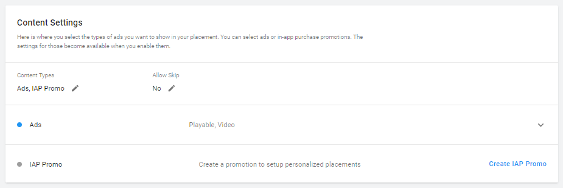
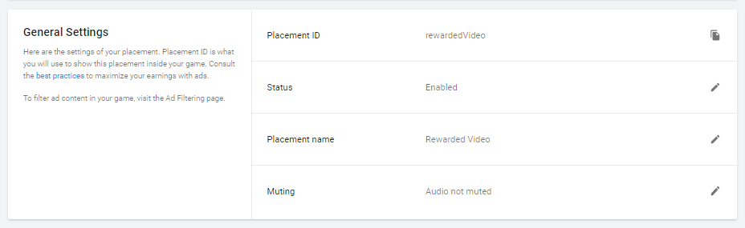

# Placements
## Overview
Placements are triggered events within your game that display monetization content. In this guide, you’ll learn how to configure, implement, and personalize Placements. 

## Managing Placements
Manage Placements from the developer dashboard:

1. From the **Operate** tab of the [developer dashboard](https://operate.dashboard.unity3d.com/), select your Project.
2. Select **Monetization** from the left navigation bar to view a list of your Project's monetization options.
3. Select **Placements** to manage and create ad Placements.

## Creating new Placements
To create a new **Placement**, click **ADD PLACEMENT** to open the **Add new placement** configuration window.

The **Placement name** you specify auto-generates a __Placement ID__, which you call in your code implementation. Note that you can change Placement name later, but once you create the Placement, you cannot change the corresponding ID.

### Placement types
### Placement types
When creating a new Placement, you must define its type:

* Select **Non-rewarded** to show basic __interstitial__ ads or promotional content. Non-rewarded Placements allow players to skip the ad after a specified period of time.
* Select **Rewarded** to allow players to opt-in to viewing ads or promotions in exchange for incentives. Rewarded Placements do not allow the player to skip the ad.
* Select __Banner__ to create a dedicated Banner ad Placement. 

**Note**: The Personalized Placement type is deprecated. For more information, see the [FAQ](MonetizationResourcesFaq.md#why-are-personalized-placements-and-iap-promo-being-deprecated-).

Each Unity Ads-enabled Project includes two default __Placements__ for your convenience:

* ‘`video`’ is a non-rewarded Placement that serves __Video ad__ and __Playable ad__ formats, and allows users to skip the ad after 5 seconds.
* ‘`rewardedVideo`’ is a rewarded Placement that serves __Video ad__ and __Playable ad__ formats, but does not allow skipping.

Our [best practices guide](MonetizationResourcesBestPracticesAds.md) provides examples of effective implementation of ad placements. 

Click **CREATE NEW PLACEMENT** to configure the Placement’s settings.

### Placement settings
You can edit Placement settings at any time by selecting the desired Placement from the **Placements** menu on the dashboard. Use the Platform dropdown in the top-right corner to specify the following Placement settings for each individual platform.

#### Content settings
These settings apply to the content you surface in your Placements.

| **Setting** | **Description** |
| :---------- | :-------------- |
| Content Types | Choose **Ads**, **IAP Promo**, or both.  With **Ads** enabled, you may select the following formats to display:  <ul><li>__Video ads__ are full-screen video advertisements.</li><li>__Display ads__ are full-screen static images.</li><li>__Playable ads__ are full-screen interactive advertisements.</li></ul> With __IAP Promo__ enabled, you can link Promos to the Placement **Note**: IAP Promo is a deprecated feature that will not be supported in the future. |
| Allow Skip | Click the Edit icon to specify the number of seconds after which users can skip ads in this Placement.  **Tip**: To run [rewarded ads](MonetizationResourcesBestPracticesAds.md#rewarded-ads) in your Placement, set this option to **No** so that the video is not skippable. |

#### General Settings
These settings apply to the behavior of the Placement itself.

| **Setting** | **Description** |
| :---------- | :-------------- |
| **Placement ID** | A unique identifier to reference in your code implementation. Once you create the Placement, you cannot change its corresponding ID. |
| **Status** | By default, a new Placement's status is **Enabled**. Click the edit icon, then uncheck **Enable Placement** and click **SAVE** to change its status to **Disabled**. Disabled Placements will not show monetization content. | 
| **Placement name** | Click the edit icon to change the Placement name. Changing this setting does not impact the Placement ID.  **Note**: The Developer Dashboard does not currently support self-serve [AR ads](MonetizationArAds.md) or [Cross-Promotion ads](MonetizationCrossPromotions.md) in Placements.
| **Muting** | By default, ads for a new Placement are not muted. If you want ads in this Placement to default to muted audio, click the Edit icon, then check **Mute audio**. |

## Implementing Placements in-game
Implementing Placements in your game is a 3-step process:

1. Initialize the Unity Ads SDK early in the game’s run-time lifecycle, preferably at launch. Unity recommends using the latest SDK (3.0+). 
2. In your code, check if Placement content is ready to display through your specified Placement.
3. Retrieve the available content and display it.

For comprehensive code integration instructions, read the documentation for your development platform:

* [Unity developers (C#)](MonetizationBasicIntegrationUnity.md)
* [iOS developers (Objective-C)](MonetizationBasicIntegrationIos.md)
* [Android developers (Java)](MonetizationBasicIntegrationAndroid.md)