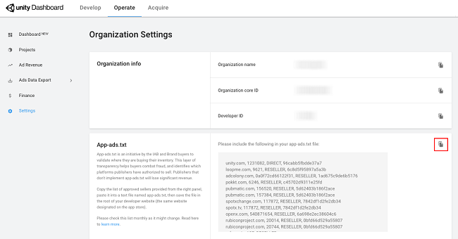

# app-ads.txt support  
## Overview
app-ads.txt is an [IAB](https://www.iab.com/) initiative to combat fraud and create transparency in the advertising ecosystem. App developers host the _app-ads.txt_ file on their site, which lists the developer’s authorized sellers. Brand advertisers and demand-side platforms (DSPs) scrape the file and cross-reference it when they buy ad inventory programmatically via exchanges, supply-side platforms (SSPs), and ad networks to verify the legitimacy of the sellers they bought the app inventory from. 

While implementing app-ads.txt is not mandatory, failing to do so will cause developers to lose significant revenue. DSPs use this file to understand the supply chain of inventory they are buying. Some DSPs will only buy from developers that have correctly implemented this file. Developers that properly declare their authorized sellers help advertisers greatly reduce the risk of counterfeit inventory, which over time funnels more advertising dollars to quality developers. 

For more information, read the [IAB Teach Lab spec](https://iabtechlab.com/wp-content/uploads/2019/03/app-ads.txt-v1.0-final-.pdf) and Unity's blog on [elevating inventory quality](https://blogs.unity3d.com/2019/09/06/elevating-inventory-quality-app-ads-txt-and-open-measurement/).

## Implementation
Unity provides the list of approved sellers, making it easy to implement this specification for your game. See the screenshot below.

1. From the [Operate dashboard](https://operate.dashboard.unity3d.com), select **Settings**, then scroll to the **app-ads.txt** section. 
2. Copy the list of sellers from the dashboard.
3. If you already have an _app-ads.txt_ file, append the copied list to your existing file. If you don't already have one, create a new file and save it with the name _app-ads.txt_, then paste the copied list in the file you created.
3. Place the _app-ads.txt_ file in the root of your developer website (the website you defined in the "developer website" field on the store pages that host your apps).

**Important**: This list may change over time. Please check the settings page monthly, or whenever you are notified.

## Frequently asked questions
#### Is this new? How does it differ from ads.txt?
app-ads.txt is specifically for mobile apps. It provides the same functionality as [ads.txt](https://iabtechlab.com/ads-txt/), but resides on the developer's website.

#### What problem is this intended to solve?
app-ads.txt protects advertisers from buying invalid or fraudulent traffic, and protects publishers from losing revenue to malicious sources intercepting their demand.

#### Why should publishers adopt app-ads.txt?
Moving forward, a number of major Brand advertisers and DSPs will only buy inventory from authorized inventories, creating a strong incentive for publishers to adopt app-ads.txt. To stay ahead of this shift in the industry and avoid missing out on revenue, Unity recommends implementing this as early as possible.

#### What is Unity’s position on app-ads.txt?
Unity strongly supports this initiative because it combats fraud and creates more transparency for mobile advertising. App developers who implement this will, in turn, see more premium advertisers and incremental revenue.

#### Why should advertisers adopt app-ads.txt?
As with ads.txt for web, this file gives advertisers greater assurance that they are buying legitimate impressions from authorized resellers.