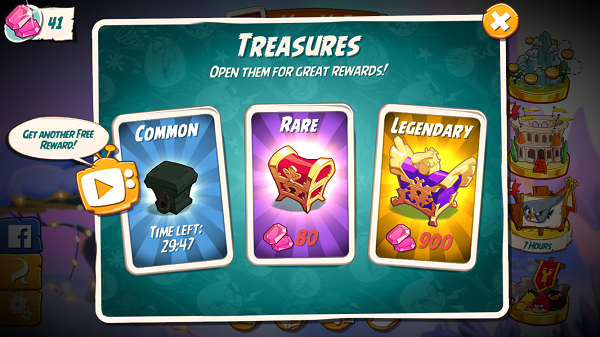
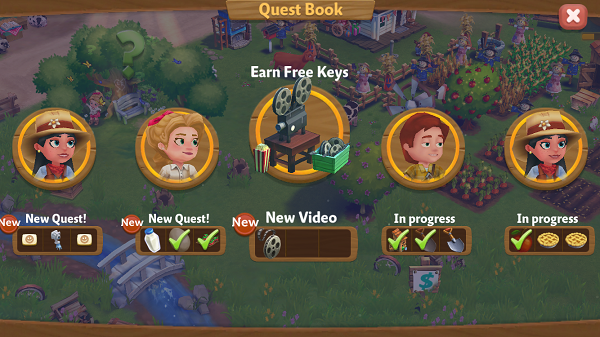
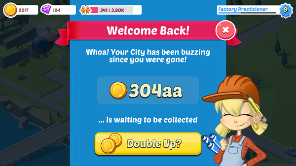
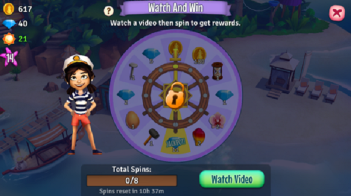
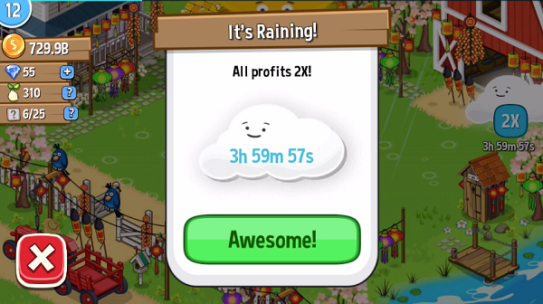
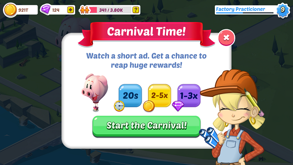
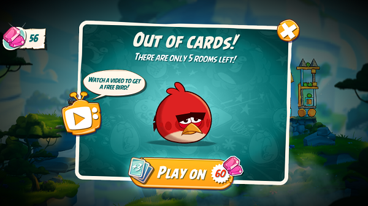
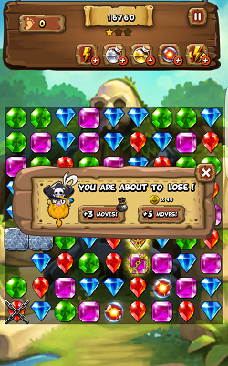

# Rewarded ads best practices
Incorporating Unity Ads is simple, but maximizing monetization requires an effective implementation strategy. When considering this, it is important to first understand how Unity Ads generates revenue, then determine the design and placement of ads in your game accordingly. In this guide, we share effective strategies and tips for optimizing your Unity Ads implementation using rewarded ads. 

Be sure to check out the in-depth [case studies](#case-studies-and-references) at the bottom of the guide.

## Understanding how ads generate revenue
Every time your game requests an ad, Unity Ads holds an open auction for advertisers to bid on your impression. The highest bidder provides an ad. Advertisers can bid on different impression types to provide a diverse source of revenue streams. The following types are listed in escalating order of expected earning potential:
 
1. Ad start (the player triggers an ad)
2. Completed view (the player watches an ad to the end)
3. Click (the player clicks the ad, leading to an external product link)
4. Install (the player clicks out to the external product page and installs the product)   
 
Your __eCPM__ (effective cost per 1000 impressions), represents your overall blended revenue across these streams. The key to maximizing your eCPM is designing your ads to consistently generate the highest quality impressions. 

For an in-depth look at Unity Ads metrics, KPI, and terminology, see documentation on [Monetization statistics](MonetizationResourcesStatistics.md).  

## Rewarded Ads
Rewarded ads provide in-game rewards to players in exchange for watching ads. When done right, the incentive to voluntarily watch ads makes rewarded ads an extremely effective form of marketing, as it helps create a positive player experience. Rewarded ads monetize better, typically yielding higher quality impressions. They can also drive help engagement and retention. As a byproduct, they increase the likelihood of players investing further through in-app purchases.

Like any other game mechanic, remember that effective ads implementation requires carefully considered game design. Think of the following tips as recommendations; the best approach will ultimately depend on the specifics of your game and incorporate input from marketing, production, and game design disciplines within your team. To learn more about design-driven monetization, watch [this presentation](https://youtu.be/s1AhKkP9nCc) from Unite ‘16.   

### Let the player choose
Allow players to opt in to watching ads, so they can choose between skipping them or receiving a reward. When players voluntarily watch an ad, they are more likely to pay attention and show interest in the advertised product. This is turn increases the quality of your impressions.

### Identify the right incentive
Encouraging players to voluntarily watch an ad requires a compelling incentive. Successful implementations tend to offer in-game currency, power-ups, additional lives, or consumable items such as potions that help players recover and flourish in the game. 

### Identify the right placement
Take the above tip a step further, by choosing the right incentive at the right time and place. When considering your ad [Placements](MonetizationPlacements.md), think about stress points in your game that might be a good opportunity for an injection of resources. Consider the following examples to spur the creative process:

#### Unique purchase opportunities
Implement a special shop type that allows the player to purchase unique items in exchange for watching an ad.

#### Earned reward multipliers
Augment retention mechanics by boosting their rewards in exchange for watching an ad. For example, double the rewards from a daily login bonus, or offer extra daily attempts to win in-game prizes.

You could also promote engagement by allowing players to watch an ad when they start a new game session in exchange for 30 minutes of double points or earned currency.

#### Unique mini-games
Create a fun mini-game available to players that choose to watch an ad. 

#### Additional lives
Allow players to continue playing if they run out of lives, in exchange for watching an ad.

#### Additional enhancements
Offer a power-up or boost if the player is about to lose, in exchange for watching an ad.

#### Ad-lib
Get creative! Offer players earned currency when they don’t have enough to purchase an item at a shop; place a character or shop right before a challenging boss fight that offers to completely heal and regenerate the player character’s resources; offer a unique consumable boost to help push players who continue to fail a mission over the top. 

As you can see, many of these examples drive retention and engagement in addition to boosting the quality of impressions.

### Pair Rewarded Ads with in-app purchasing
Because Rewarded Ads are effective retention mechanics, they complement in-app purchasing systems quite well. Rewarded Ads often generate engagement through reward and investment, which encourages further investment through other monetization channels. Strive for a diverse monetization approach that provides opportunities for both. For example, consider running Rewarded Ads that grant small amounts of premium currency, offsetting the cost of paid content. Players with a little premium currency may buy more to supplement a purchase they’re eyeballing, rather than let their currency go to waste. For more insight, read [How to get the most out of currency sales](https://blogs.unity3d.com/2016/12/07/just-in-time-for-the-holidays-how-to-get-the-most-out-of-currency-sales/).

Remember, it’s important that your ads integration encourages in-app purchases instead of competing with them and cannibalizing revenue (see section below).

### Don’t lose sight of your game’s economy
Ad rewards should complement in-app purchase items rather than compete with them. As a general rule, Rewarded Ads should provide small benefits that drive engagement & retention, while in-app purchases should provide larger benefits that feel worth the financial investment. When possible, try to avoid offering purchasable items as ad rewards. 

Aside from not wanting to cannibalize in-app purchase revenue, remember that Rewarded Ads infuse the game economy with more digital goods. This can impact game balance and diminish the value of other rewards if not done responsibly. Game designers typically craft their in-game economies meticulously, so double-check that your implementation isn’t harmful in that regard and always design incentives in keeping with their expected values within the economy.  

Examples:
* If a special sword sells in the IAP store for $4.99, but players can get it in exchange for watching an ad, they will never have a reason to buy it. Offering small amounts of premium currency that can be applied towards purchasing the sword is a better approach.
* If the reward for watching an ad is on par with the reward for winning an extremely challenging battle, the experience of succeeding feels cheapened and can hurt engagement. 
* If a health potion costs 100 Gold, but players can get health potions free at any time for watching an ad, that can devalue health potions and potentially even Gold itself. 

### Take advantage of ad filters
Unity Ads has robust tools for filtering the ad content you show. No one understands your game’s demographics better than you; targeting them with content that is relevant to their interests enhances the likelihood of interacting with that content and creating higher quality impressions. The [Ads Monetization Dashboard](https://operate.dashboard.unity3d.com) allows you to exclude content based on genre, age rating, and theme. For more information, see documentation on [ad content filters](MonetizationResourcesDashboardGuide.md#ad-filters).

### Preserve the user experience
Design your ads to fit your game, with as little disruption to the user experience as possible. For example, if you choose to implement interstitial ads, use them strategically and strive to place them at natural pauses or breaks in gameplay, such as a load or level change. 

In general, focus on well-designed ad placements and incentives rather than sheer volume. A great ads implementation becomes part of the game experience, making it more enticing for players to engage. Done right, it can be a positive experience that players look forward to repeating on top of the reward incentive. At the end of the day, your ads monetization success depends on this engagement, as building traffic and DAU in turn boosts impressions.  

## Case studies and references
Uken paired rewarded ads with IAP to improve baseline engagement, retention, and overall revenue with no cannibalization of in-app purchases.
* [Read the case study](https://unity3d.com/mobile-games-monetization--case-stories/uken)

Pixonic used rewarded ads to lift revenue without cannibalizing from paying players.
* [Read the case study](https://venturebeat.com/2018/04/29/how-to-add-video-ads-to-a-game-and-make-people-ask-for-more/)

Space Ape used Unity as its exclusive ad supplier to help balance IAP with rewarded videos in a way that makes players happy. The result was improved DAU, user LTV, and ad revenue.
* [Read the case study](https://drive.google.com/open?id=1gY6Mv83SHgD0i4MOwgFC5K7B8sVjKC9M)

Next Games used rewarded ads to increase player LTV. 
* [Read the Next Games case study](http://response.unity3d.com/ads-case-study-next-games)
* [Watch the Unite Europe 2016 talk](https://www.youtube.com/watch?v=Hl3HJdfJ8vs)

A hobbyist developing games in his spare time used Unity Ads to help grow to 10 million-plus downloads.
* [Read the Twimler case study](http://response.unity3d.com/mobile-case-study-twimler)

Unity Ads helped Playdots, Inc. monetize an enormous user base in a way the players have embraced.
* [Watch the video](https://www.youtube.com/watch?v=nig-Zy-G_PM)

Futureplay showcases how Unity Ads drives revenue through engagement and retention.
* [Read the Futureplay case study](http://response.unity3d.com/ads-case-study-futureplay) 

Unity Ads helped Game Hive monetize an expanding user base without alienating players by pioneering a best practice model for ‘view-to-play’ monetization en route to over 100 million downloads across iOS and Android.
* [Read the Game Hive case study](http://response.unity3d.com/ads-case-study-game-hive)

Want to learn more? Unity Blogs has plenty of additional reading: 
* [Best Practices for Rewarded Video Ads](https://blogs.unity3d.com/2016/04/20/best-practices-for-rewarded-video-ads-2/)
* [Unity white-paper on strategic in-game advertising](https://drive.google.com/file/d/0B5trVLB_mEPWNDRDVmlzeUxfS2s/view)
* [Zynga & Unity: Exclusive Rewarded Advertising](https://blogs.unity3d.com/2017/08/02/zynga-unity-exclusive-rewarded-ads/)

## What's next?
Learn how [Personalized Placements](MonetizationPersonalizedPlacements.md) harnesses machine learning and [IAP Promos](https://docs.unity3d.com/Manual/IAPPromo) to lift your revenue to the next level.