# Operate dashboard guide
## Overview
The **Operate** tab of the [developer dashboard](https://operate.dashboard.unity3d.com/) provides tools to manage monetization across your Unity Projects. From the dashboard, you can configure [Placements](MonetizationPlacements.md), filters, test devices, [IAP Promos](https://docs.unity3d.com/Manual/IAPPromo.html), and revenue reports to maximize your earning potential.

### Guide contents
* [Org-level navigation](#organization-level-navigation)
    * [Dashboard](#dashboard)
    * [Projects](#projects)
    * [Ad revenue](#ad-revenue)
    * [Ads Data Export](#ads-data-export)
    * [Finance](#finance)
    * [Settings](#settings)
* [Project-level navigation](#project-level-navigation)
    * [Overview](#overview)
    * [Reporting](#reporting)
    * [Monetization](#monetization)
    * [Optimization](#optimization)
    * [Analytics](#analytics)
    * [Project Settings](#project-settings)
* [Managing Projects](#managing-projects)
    * [Adding Projects](#adding-projects)
    * [Enabling an existing Project](#enabling-an-existing-project)
    * [Editing Projects](#editing-projects)
    * [Archiving Projects](#archiving-projects)

## Organization-level navigation
By default, you enter the dashboard at the Organization level (for more information, see [Unity Organizations](https://docs.unity3d.com/2018.1/Documentation/Manual/OrgsUnityOrganizations.html)). The information on the **Operate** landing page applies to your entire Organization, rather than a specific Project. 

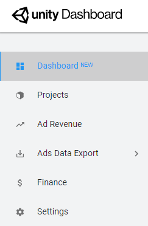

Use the left navigation bar to select your desired option.

### Dashboard
Select Dashboard from the left navigation bar to display your Organization’s at-a-glance revenue report. The overview shows the following performance metrics across your Organization’s entire Project portfolio:

* Ad revenue over the last 24 hours
* Ad revenue over the last 30 days
* Average daily active users (DAU)
* Total unpaid earnings (see documentation on [automated payouts](MonetizationResourcesRevenueAndPayment.md#automated-payouts))

A more detailed dashboard appears below the overview. Here you can filter metrics for favorite Projects, ad revenue, and total revenue by date range and platform.

#### Favorite projects
Specify Projects to highlight in your Organization dashboard by clicking **Add favorites** (or navigating to the **Projects** menu), then clicking the star icon next to desired Projects.

#### Ads performance
Ads performance tracks the following ad revenue metrics across your Organization’s portfolio:

* Ads Revenue 
* eCPM (effective cost per mille)
* Impressions
* Fill Rate 

Each metric displays the performance delta over the previous reporting period. Positive improvements appear green, while negative changes appear red. 

For more information on each metric, see documentation on [Monetization statistics](MonetizationResourcesStatistics.md#terminology). To view a more detailed report, click **See more** or navigate to the **Ad Revenue** menu.

**Note**: Metrics in this section do not include revenue from IAP or Promotions.

#### Total Revenue
This chart displays your Organization’s total revenue over the course of the specified period, broken down into top performing Projects.

### Projects
Select **Projects** from the left navigation bar to view a list of your Organization’s Projects. The list view provides at-a-glance information about each Project’s **Total Revenue**, **Ad Revenue**, **New Users**, **DAU** (daily active users), and **ARPDAU** (average revenue per daily active user).

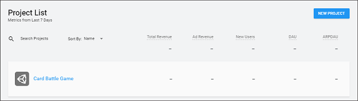

Select any Project from the list to manage that Project’s operations settings (see section on [**Project-level navigation**](#project-level-navigation)).

For more information, also see section on [**Managing Projects**](#managing-projects).

### Ad Revenue
The Ad Revenue report gives you detailed ad performance metrics for your Organization. 

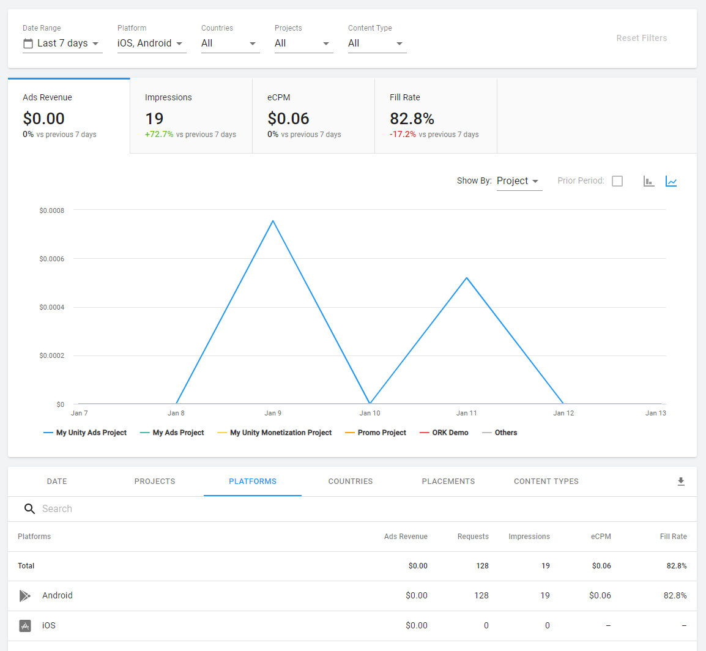

Use the filters to isolate data by date range, platform, country, Project, or [content type](MonetizationContentTypes.md). 

The chart (top) provides a visualization of each performance metric. Use the dropdown menu to plot results by date, platform, country, Placement, or Project. Click the chart icons to toggle between bar and line graphs.

The table (bottom) provides performance metric data as an exportable CSV file. Click the tabs to parse results by date, Project, platform, country, Placement, or [content type](MonetizationContentTypes.md). Click the download icon to export the data into a CSV file.

### Ads Data Export
#### Email & CSV
Select **Ads Data Export** > **Email & CSV** from the left navigation bar to export a monetization report for your Organization. 

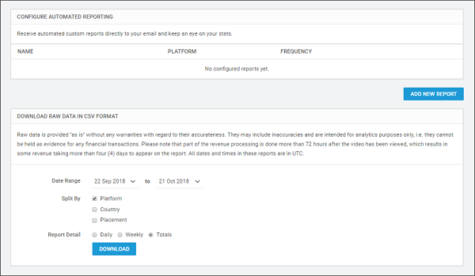

For more information on configuring reports, see documentation on [Monetization statistics](MonetizationResourcesStatistics.md).

#### Test Devices
Select **Ads Data Export** > **Test Devices** from the left navigation bar to register an iOS or Android device for testing your Unity Ads or IAP integration without monetizing the device. This is important for testing integration in unpublished games, to avoid being flagged for fraud.  Click **Add New Device** to register a new test device.

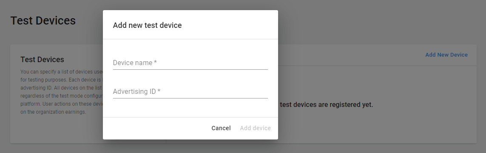

Enter your device's name in the first input field, and your IDFA (ID for advertising) in the second input field. For more information on locating your device's IDFA, see documentation on [How to find your mobile device identifiers](https://www.mparticle.com/resources/how-to-find-your-mobile-device-identifiers).

#### API Access
Select **Ads Data Export** > **API Access** from the left navigation bar to locate your Organization’s API key. This key is required for generating reports through the [Monetization statistics API](MonetizationResourcesStatistics.md#using-the-monetization-stats-api).

### Finance
Select **Finance** from the left navigation bar to configure [automated payouts](MonetizationResourcesRevenueAndPayment.md#automated-payouts) and view payout transaction history. For more information, see documentation on [revenue and payment](MonetizationResourcesRevenueAndPayment.md).

#### Revenue transfers
Unity allows you to allocate a portion of your ad revenue into an advertising budget on the [Acquire dashboard](https://acquire.dashboard.unity3d.com/). For more information, see documentation on [transferring revenue](MonetizationResourcesRevenueAndPayment.md#revenue-transfers).   

[Learn more](https://blogs.unity3d.com/2020/01/08/7-steps-to-grow-your-game-with-paid-user-acquisition/) about driving user acquisition with Unity advertising.

### Settings
The Settings menu contains information pertinent to your Organization and related services.

#### Organization info

* **Organization name** is your Organization’s identifier on the developer dashboard.
* **Organization Core ID** is required to pull data from the [Monetization Statistics API](MonetizationResourcesStatistics.md#using-the-monetization-stats-api).
* **Developer ID** is required for implementing the `app-ads.txt` spec for Unified Auction Exchange’s [Authorized Sellers for Ads](MonetizationResourcesFaq.md#authorized-sellers-for-apps-faqs) certification. 

#### app-ads.txt
Game Developers should implement `app-ads.txt` as directed in order to optimize potential for revenue from Brand advertising. By the first half of 2020, many DSPs will start to only buy inventory properly authorized in the app-ads.txt. For more information about how to implement `app-ads.txt`, please see this [FAQ](MonetizationResourcesFaq.md#authorized-sellers-for-apps-faqs). 

## Project-level navigation
Select a Project to drill down into that Project’s dashboard settings. 

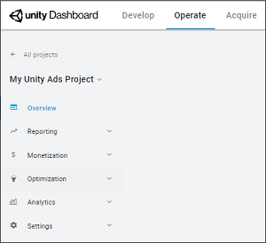

Use the left navigation bar to select your desired option.

### Overview
Select **Overview** from the left navigation bar to display your Project’s at-a-glance revenue report. You can view statistics on **Total Revenue**, **Average DAU** (daily active users), or **Day 1 Retention** across all the Organization’s Projects. You can also filter the data by platform or date range.

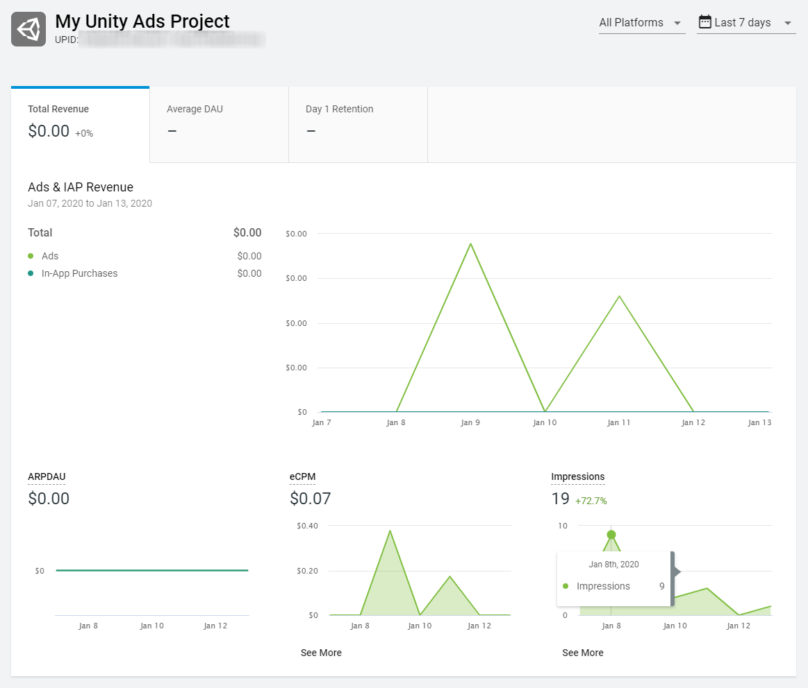

### Reporting
#### Ad Revenue Report
Select **Reporting** > **Ad Revenue** from the left navigation bar to view a breakdown of ad revenue for the selected Project. 

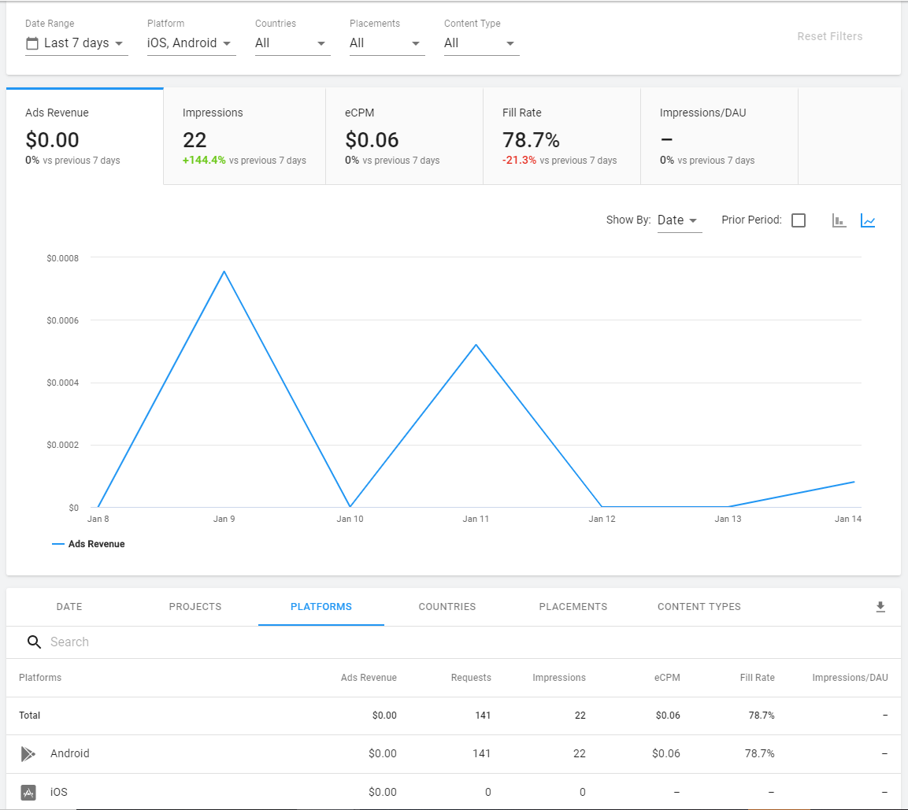

Use the filters to isolate data by date range, platform, country, [Placement](MonetizationPlacements.md), or [content type](MonetizationContentTypes.md). 

The chart (top) provides a visualization of each performance metric. Use the dropdown menu to plot results by date, platform, country, Placement, or Project. Click the chart icons to toggle between bar and line graphs.

The table (bottom) provides performance metric data as an exportable CSV file. Click the tabs to parse results by date, Project, platform, country, Placement, or [content type](MonetizationContentTypes.md). Click the download icon to export the data into a CSV file.

#### IAP Purchases
Select **Reporting** > **IAP Purchases** from the left navigation bar to view a breakdown of In-App Purchasing ([IAP](https://docs.unity3d.com/Manual/UnityIAP.html)) revenue for your Project. 

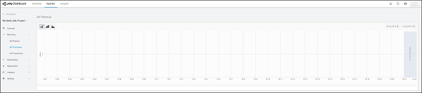

You can filter data by date range, and display it as a spline chart, bar chart, or stacked chart.

#### IAP Promotions
Select **Reporting** > **IAP Promotions** from the left navigation bar to view analytic insights for your Project’s [IAP Promo](https://docs.unity3d.com/Manual/IAPPromo.html) performance. For more information on configuring Promos, see documentation on  [**IAP Promo integration**](https://docs.unity3d.com/Manual/IAPPromoIntegration.html).

You can filter the following metrics by Promotion and date range: 

* **IAP Revenue**: The cumulative revenue generated from Promo offers.
* **Users**: The number of users exposed to Promo offers.
* **ARPPU**: The [average revenue per paying user](https://en.wikipedia.org/wiki/Average_revenue_per_user).
* **Conversions**: The percent of exposed users that purchased the offer.
* **Return Rate (7 days)**: The 7-day retention of users after exposure to a Promo offer.

**Note**: The IAP Promo feature is deprecated. However, if you have implemented Promotions in your game, the dashboard will continue reporting revenue until March 31, 2020. For more information, see the [FAQ](MonetizationResourcesFaq.md#why-are-personalized-placements-and-iap-promo-being-deprecated-).

### Monetization
#### Placements
Select **Monetization** > **Placements** from the left navigation bar to create and manage Placements for your Project. For more information, see documentation on [Placements](MonetizationPlacements.md).

You can also find your Project’s [Game IDs](#game-ids) for iOS and Android here. 

#### eCPM Pricing
[eCPM](https://en.wikipedia.org/wiki/Cost_per_mille) (effective cost per mille) is the average amount your game earns from advertisers per thousand impressions. Your game’s eCPM affects how advertisers bid on your ad space. The eCPM pricing tool allows you to set desired eCPM thresholds for ads to be served. Unity will target that price and optimize to deliver the desired CPM. 

**Important**: While this can help drive your desired eCPM, implementing these restrictions will limit delivery and potentially impact your overall revenue. Higher targets have higher risks of lowering potential revenue.

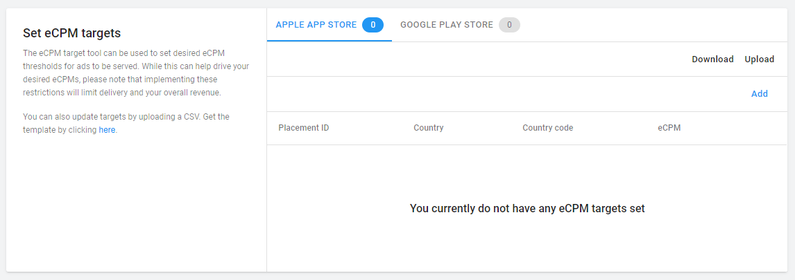

Use the dashboard interface to set eCPM targets by app store, region, and Placement. To set a new target, click **Add**.

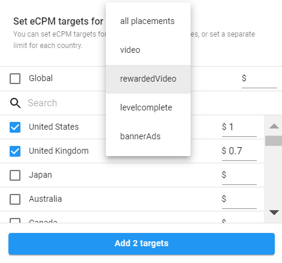 

You can also update targets by uploading a CSV file. You can download the template from the dashboard, or export your existing targets by clicking **Download**. Click **Upload** to import your updated file.

#### Ad filters
Select **Monetization** > **Ad Filters** to refine your ad strategy by choosing your specific content preferences. 

**Note**: While ad filters are often advantageous, blocking content categories or applying age limits can negatively impact your revenue by creating a smaller pool of bidders. For more information on this trade off, please read our [best practices guide](MonetizationResourcesBestPractices.md).

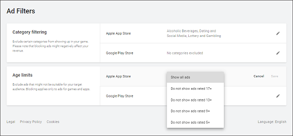

* **Category filtering**: Click the edit icon to edit category exclusions for each platform. Check the categories you wish to include, then click **Save** to confirm your settings.
* **Age limits**: Click the edit icon to specify the appropriate age limit for your game on each platform. Unity rates ad creatives as part of its [moderation](AdvertisingCampaignsConfiguration.md#moderation) process. Advertisements targeting older audiences will not be allowed to bid on your impressions. Click **Save** to confirm your settings.

Both Google and Apple introduced requirements to ensure that apps that are directed at children and serve ads are safe to use. If you serve ads in your app and wish to participate in Google’s [Designed for Families](https://developer.android.com/google-play/guides/families) program or the [Apple Kids Category](https://developer.apple.com/app-store/review/guidelines/#kids-category), you must configure the [**Age designation** setting](MonetizationResourcesDashboardGuide.md#project-info) to **This app is directed to children under the age of 13**, and set your **Age limits** filter to **Do not show ads rated 13+** or stricter.

**Note**: Configuring the **Age designation** setting to **This app is directed to children under the age of 13** does not automatically set your age filters accordingly. If you wish to participate in these categories, you must also set the age filter manually. 

**Important**: Unity does not provide legal advice. Therefore the information on this page is not a substitute for reading the Apple App Store or Google Play guidelines, applicable publisher terms, or seeking your own legal counsel to determine the legal requirements of your business and processes, and how to address them.

If you have additional questions or unique requests regarding ad filtering, [contact Unity Ads support](mailto:unityads-support@unity3d.com).

#### In-App Purchases
Select **Monetization** > **In-App Purchases** from the left navigation bar to import and manage IAP Product Catalogs for your Project. For a complete guide, see documentation on [**Product Catalogs**](https://docs.unity3d.com/Manual/IAPPromoProducts.html). 

#### IAP Promotions
The IAP Promo feature is deprecated. For more information, see the [FAQ](MonetizationResourcesFaq.md#why-are-personalized-placements-and-iap-promo-being-deprecated-).

### Optimization
Use unique analytics and machine learning features to fine-tune your games. 

#### A/B Testing (Beta)
Conduct A/B tests to improve your game. Choose the best settings based on data. Gain the insight you need to make superior decisions.

For more information, see documentation on [A/B testing](https://docs.unity3d.com/Manual/UnityAnalyticsABTesting.html).

**Note**: This feature differs from [Unity Remote Config](https://docs.unity3d.com/Packages/com.unity.remote-config@latest/index.html), which can also be used for A/B testing.

#### Remote Settings
Use Remote Settings to control properties in your game from the dashboard. You can change game appearance and behavior without needing to release an application update.

For more information, see documentation on [**Remote Settings**](https://docs.unity3d.com/Manual/UnityAnalyticsRemoteSettings.html).

**Note**: This feature differs from [Unity Remote Config](https://docs.unity3d.com/Packages/com.unity.remote-config@latest/index.html), which can also be used to dynamically change game settings without requiring an application update.

#### GameTune
[GameTune](https://unity.com/unity/features/gametune) leverages machine learning to automatically optimize and improve elements like game progression speed or monetization opportunities. Read the [documentation](http://docs.gametune.unity3d.com/) to learn more about the beta. 

### Analytics
Use [Unity Analytics](https://docs.unity3d.com/Manual/UnityAnalytics.html) to evaluate and improve your game through data.

For a detailed breakdown, see documentation on the [Analytics dashboard](https://docs.unity3d.com/Manual/UnityAnalyticsDashboard.html).

### Project Settings
From the left navigation bar, select **Settings** > **Project Settings** to view and configure operational settings for your Project.

#### Game IDs
You need the __Game ID__ for each platform to [initialize the Unity Ads](MonetizationBasicIntegrationUnity.md#initializing-the-sdk) and [Unity IAP](https://docs.unity3d.com/Manual/UnityIAPInitialization.html) SDKs in your code. You cannot edit these IDs.

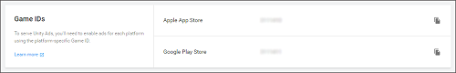

#### Project info
Find the following properties for your Project here:

- **Project name** is the name of your Project. Though you cannot edit this setting here, Organization __owners__ can do so by navigating to the [Develop dashboard tab](https://developer.cloud.unity3d.com/), then selecting **Settings** > **General**, and following the prompts to rename your Project. 
- __Project ID__ is a unique identifier for your Project. 
- **Age designation** indicates whether your Project is directed at children under the age of 13 in the United States (required for [COPPA](https://www.ftc.gov/enforcement/rules/rulemaking-regulatory-reform-proceedings/childrens-online-privacy-protection-rule) compliance).

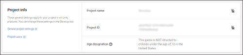

#### Store IDs
Optionally link your Project to live Store IDs for the game’s Apple or Google Play app page. Skipping this step does not prevent you from showing ads, however, some of Unity's advertising partners require this information. In order to maximize revenue opportunities, please make sure you include it when your game is live.

Extract the **Apple App Store ID** from your game’s URL, as shown in the highlighted section of the following URL:

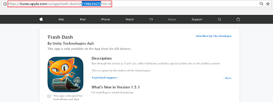

Extract the **Google Play Store ID** from your game’s URL, as shown in the highlighted section of the following URL:

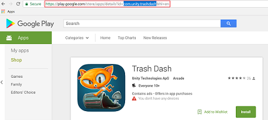

**Note**: If you recently published your app, Unity may be unable to look up its ID. Should you encounter this error, please try again 5-7 days after the publish date.

#### Test mode
Test mode allows you to test your integration without serving live ads. Use this setting to override programmatic settings on a device, by toggling **Override client test mode**, then checking **Force test mode ON (i.e. use test ads) for all devices**. It is important to enable test mode before testing integration to avoid getting flagged for fraud.

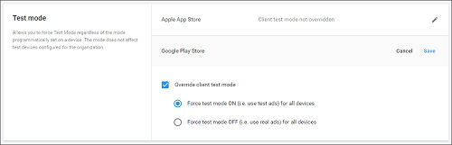

#### Unity Analytics Optimization
Toggle whether Unity can collect revenue-optimizing data, including time that users spend in your application, application updates, and transaction events.

#### Ad delivery status
The **Enable ad delivery** toggle allows you to temporarily stop serving ads to your application.

### Analytics Settings
From the left navigation bar, select **Settings** > **Analytics Settings** to view and configure settings that are specific to managing your Unity Analytics data. 

For more information, see documentation on [Analytics settings](https://docs.unity3d.com/Manual/UnityAnalyticsDashboardConfigure.html).

## Managing Projects
To manage Projects, navigate to the **Operate** tab of the [Developer Dashboard](https://operate.dashboard.unity3d.com/organizations), and ensure no Projects are selected. Select **Projects** from the left navigation bar to view a list of your Organization’s Projects.

### Adding Projects
Click **NEW PROJECT** to create a Project under your selected Organization.

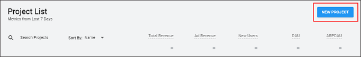

Enter the following information in the **Add new project** prompt:

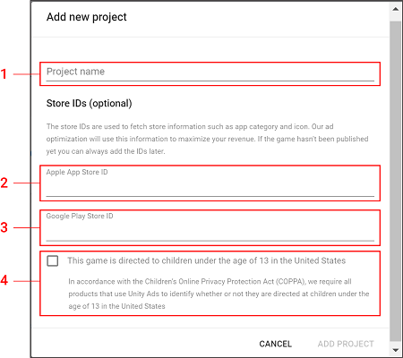

1. **Project name** acts as the title by which your Project is identified in the dashboard UI.
2. **Apple App Store ID** is optional, but recommended for published games to maximize access to third-party advertising partners.
3. **Google Play Store ID** is optional, but recommended for published games to maximize access to third-party advertising partners.  **Note**: You can always add store IDs later by selecting the Project, then **Monetization** > **Platforms** > **ADD STORE DETAILS**. For more information on locating the relative store IDs, see section on Adding store details.  
4. Check the COPPA compliance designation if your game will target an audience under 13 years old in the United States. 

Click **ADD PROJECT** to create your Project. Projects created in the Developer Dashboard automatically enable the Operate services.

### Enabling an existing Project
Projects created in the Unity Editor do not enable Operate services by default. If a Project’s Operate services are not enabled, selecting them on the dashboard Projects list will prompt you to do so. 

Click **TURN ON OPERATE**, then set the app store IDs and COPPA compliance designation appropriately to enable services.  

### Editing Projects
To edit your Project name or [transfer it to a different organization](https://support.unity3d.com/hc/en-us/articles/213524303-How-do-I-transfer-my-Project-to-a-different-Unity-Organization-), navigate to the **Develop** tab of the [Developer Dashboard](https://developer.cloud.unity3d.com/), then select **Settings** > **General** from the left navigation bar.

### Archiving Projects
This [help article](https://support.unity3d.com/hc/en-us/articles/115000075126-How-do-I-archive-a-Project-) details how to archive old Projects that are cluttering your dashboard, and how to view or change the status of archived Projects.