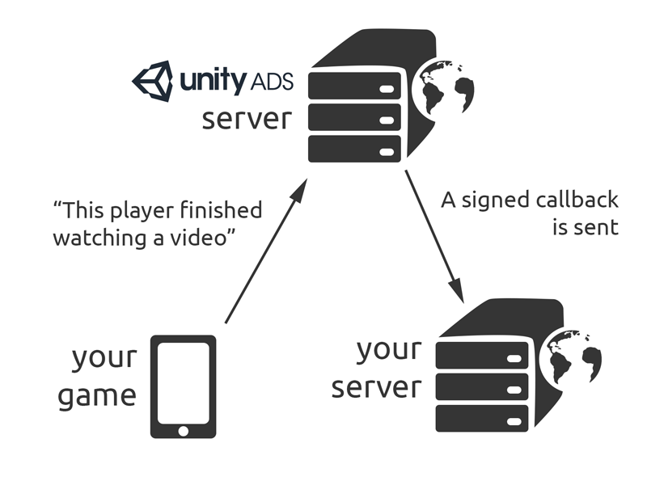

# S2S redeem callbacks
Server-to-server callbacks are sent to your server when a user has watched an ad. You can use these callbacks to reward players with virtual goods and to e.g. detect and prevent cheating.



**Important**: Server-to-server redeem callbacks are not available by default. If you want to enable them for your game, please [contact our support](mailto:unityads-support@unity3d.com) and provide your [Game ID(s)](MonetizationResourcesDashboardGuide.md#project-settings) and their respective callback URL(s) in the message. You will receive a secret hash used to sign and validate the callbacks.

When your player finishes watching the ad, the Unity Ads server sends a signed callback to the URL you've specified. This occurs before the actual end of the video, so that the reward cycle can be completed before the user returns to the game. To avoid distractions for the user, display the reward notification after the ad view is finished. 

Depending on traffic, it can take some time for the callbacks to arrive. To ensure a smooth gameplay experience, reward the players immediately and use the S2S callbacks for sanity checks against cheating.

To use S2S callbacks, you need to set a server ID (__SID__) before showing an ad.

#### Unity (C#) example

```
using UnityEngine;
using System.Collections;
using UnityEngine.Monetization;

public class UnityAdsManager : MonoBehaviour {
    public string gameId;
    public string placementId = "rewardedVideo"
    public bool testing = false;

    public void Awake (){
        Monetization.Initialize (gameId, testing);
    }

    // Call this method when a placement is ready
    public void ShowAd () {
        ShowAdPlacementContent ad = Monetization.GetPlacementContent (placementId) as ShowAdPlacementContent;
        ad.gamerSid = "example";
        ad.Show ();
    }
}
```

In the native SDK, this is done with the `PlayerMetaData` API class.

#### Android (Java) example
```
    if(UnityAds.isReady()) {
        PlayerMetaData playerMetaData = new PlayerMetaData(context);
        playerMetaData.setServerId("example");
        playerMetaData.commit();

        UnityAds.show(activity);
    }
```

#### iOS (Objective-C) example

```
    if([UnityAds isReady]) {
        id playerMetaData = [[UADSPlayerMetaData alloc] init];
        [playerMetaData setServerId:@"example"];
        [playerMetaData commit];

        [UnityAds show:self];
    }
```

### Callback Origin
The callback originates from the IP addresses or networks listed [here](https://static.applifier.com/public_ips.json). This list is updated on the first of each month. You can safely ignore or block callbacks from anywhere else.

### Callback URL format
The request is an HTTP/1.1 `GET` request to a URL with the following format:

```
[CALLBACK_URL][SEPARATOR1]sid=[SID][SEPARATOR]oid=[OID][SEPARATOR]hmac=[SIGNATURE]
```

The parameters are explained as follows:

| **Parameter** | **Description** |
| ------------- | ----------- |
| `CALLBACK_URL` | The base URL of the callback URL (for example, `https://developer.example.com/award.php?productid=1234`). To configure this, contact unityads-support@unity3d.com. |
| `SEPARATOR1` | If `?` does not exist in the URL yet, `?` is used; otherwise `&` is used. |
| `SID` | The user ID or any custom data you want to send to your endpoint. Above examples illustrate setting the SID on different platforms (for example, `1234567890`). |
| `SEPARATOR` | `&` |
| `OID` |The unique offer ID generated by Unity Ads servers (for example, `0987654321`). |
| `SEPARATOR` | `&` |
| `SIGNATURE` |An HDMAC-MD5 hash of a parameter string, as described below (for example, `106ed4300f91145aff6378a355fced73`). |

An example URL might be:

```
https://developer.example.com/award.php?productid=1234&sid=1234567890&oid=0987654321&hmac=106ed4300f91145aff6378a355fced73
```

### Signing the callback URL
The callback URL request will have a signature attached to the URL parameters. The signature is an HDMAC-MD5 hash of a parameter string created by concatenating all the URL parameters in key-value form (excepting the HMAC in alphabetical order, separated by commas).

For example, a callback URL with an SID and OID of `https://developer.example.com/award.php?productid=1234&sid=1234567890&oid=0987654321` will have a parameter string '`oid=0987654321,productid=1234,sid=1234567890`', which is then hashed with a secret key provided by Unity support.

**Note**: All the parameters included in the callback URL must be included in the signature calculation in alphabetical order, otherwise the signatures will not match.

### Callback response
If the request passes all the checks and the user is rewarded, the URL must reply with a `HTTP/1.1 200 OK` response, and include the character "`1`" in the body of the HTTP request. For example:

```
HTTP/1.1 200 OK
Date: Wed, 22 Feb 2012 23:59:59 GMT
Content-Length: 8

1
```

If there’s an error, the server should return an HTTP error in the `400-` or `500-`range with a message describing the error. For example:

```
HTTP/1.1 400 ERROR
Date: Wed, 22 Feb 2012 23:59:59 GMT
Content-Length: 12

Duplicate order
```

#### Callback example in node.js
The following example shows how to verify the signature using `node.js` + express:

```
// NODE.js S2S callback endpoint sample implementation
// Unity Ads

var express = require('express');
var crypto = require('crypto')
var app = express();


app.listen(process.env.PORT || 3412);

function getHMAC(parameters, secret) {
	var sortedParameterString = sortParams(parameters);
	return crypto.createHmac('md5', secret).update(sortedParameterString).digest('hex');
}

function sortParams(parameters) {
	var params = parameters || {};
	return Object.keys(params)
		.filter(key => key !== 'hmac')
		.sort()
		.map(key => params[key] === null ? `${key}=` : `${key}=${params[key]}`)
		.join(',');
}

app.get('/', function (req, res) {

	var sid = req.query.sid;
	var oid = req.query.oid;
	var hmac = req.query.hmac;

	// Save the secret as an environment variable. If none is set, default to xyzKEY
	var secret = process.env.UNITYADSSECRET || 'xyzKEY';

	var newHmac = getHMAC(req.query, secret);

	if (hmac === newHmac) {
		// Signatures match

		// Check for duplicate oid here (player already received reward) and return 403 if it exists

		// If there's no duplicate - give virtual goods to player. Return 500 if it fails.

		// Save the oid for duplicate checking. Return 500 if it fails.

		// Callback passed, return 200 and include '1' in the message body
		res.status(200).send('1');

	} else {
		// no match
		res.sendStatus(403);
	}

});
```

#### Callback example in PHP
The following example shows how to verify the signature in PHP:

```
<?php
function generate_hash($params, $secret) {
   ksort($params); // All parameters are always checked in alphabetical order
   $s = '';
   foreach ($params as $key => $value) {
     $s .= "$key=$value,";
   }
   $s = substr($s, 0, -1);
   $hash = hash_hmac('md5', $s, $secret);
   return $hash;
}

$hash = $_GET['hmac'];
unset($_GET['hmac']);
$signature = generate_hash($_GET, 'xyzKEY'); // insert here the secret hash key you received from Unity Ads support
error_log("req hmac".$hash);
error_log("sig hmac".$signature);

// check signature
if($hash != $signature) { header('HTTP/1.1 403 Forbidden'); echo "Signature did not match"; exit; }

// check duplicate orders
if(check_duplicate_orders($_GET['oid']) { header('HTTP/1.1 403 Forbidden'); echo "Duplicate order"; exit; }

// if not then give the player the item and check that it succeeds.
if(!give_item_to_player($_GET['sid'], $_GET['product']) { header('HTTP/1.1 500 Internal Server Error'); echo "Failed to give item to the player"; exit; }

// save the order ID for duplicate checking
if(save_order_number($_GET['oid']) { header('HTTP/1.1 500 Internal Server Error'); echo "Order ID saving failed, user granted item"; exit; }

// everything OK, return "1"
header('HTTP/1.1 200 OK');
echo "1";
?>
```

## What's next?
View documentation on [rewarded ads best practices](MonetizationResourcesBestPracticesAds.md) to get the most out of your implementation.