# Revenue and payment
This article provides an overview of how to accrue and collect revenue from Unity Ads.

## Earning revenue
Unity Ads generates revenue by displaying paid advertisements in your game. The more traffic and [impressions](MonetizationResourcesStatistics.md#terminology) your game creates, the more money you can earn.
 
Unity Ads facilitates different campaign types with different billing points (for example, completed views, clicks, or installs), and always selects the highest-earning campaign to display to your users. 

### Monetization factors
The average [eCPM](https://en.wikipedia.org/wiki/Cost_per_mille) for Unity Ads depends on many factors, such as platform, region, player demographics, and in-game placements. The biggest factor is the number of players engaging in your game. The [ads best practices guide](MonetizationResourcesBestPracticesAds.md) provides advice on maximizing revenue through strategic implementation.

### Analyzing revenue
You can view statistics on your ads monetization from the [developer dashboard](https://operate.dashboard.unity3d.com/). If your revenue displays $0.00, you may need to be patient. Each time a video is started, it creates an impression. However, it may take around 5000 impressions for our targeting algorithms to determine the quality of users provided and start showing consistent revenue. 

For more information on using the Developer Dashboard to analyze revenue metrics, see documentation on [monetization statistics](MonetizationResourcesStatistics.md).

## Payment
### Automated payouts
Publishers can receive automated payouts for their Unity Ads earnings every month. This article provides a step-by-step guide to configuring automated payouts for your Organization. To get started, log in to the [Unity ID](https://id.unity.com) portal.

**Note**: Unity Ads currently only supports payouts in USD.

### Payout profiles
In order to receive payment, you must configure a payout profile. Payout profiles are associated with Organizations. Each Organization has one profile per service, so you can only create one profile for your Unity Ads earnings.

**Note**: You must be the Organization’s **Owner** to see, create, or update its payout profile. For more information on Organizations and roles, see the **Members and Groups** section of the [**Managing your Organization**](https://docs.unity3d.com/Manual/OrgsManagingyourOrganization.html) documentation.

To navigate to the desired Organization’s payout profile interface:

1. Log in to the [Unity ID](https://id.unity.com) portal.
2. Select **Organizations** from the left navigation bar.
3. Select the desired Organization from the list (you can also view your role within the Organization from this list; verify that you are the Organization’s **Owner**).  
**Important**: Make sure you select the correct Organization, especially if you have Owner permissions for multiple Organizations. Failing to do so may result in not receiving payouts.  
4. Select **Payout Profile** from the left navigation bar sub-menu.

#### Creating a payout profile
From your Organization’s **Payout Profile** page, create a new profile by clicking **+ Add profile**. 

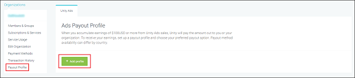

#### SMS Two-Factor Authentication (TFA)
You must enable SMS-based [TFA](https://en.wikipedia.org/wiki/Multi-factor_authentication) in order to edit payout profiles. If you have yet to enable it for your Organization, the dashboard will prompt you to do so now. If you already set up SMS TFA authentication, skip to the [Profile information](#populating-profile-information) section below.

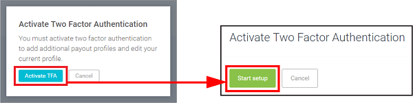

1. Click **Activate TFA** > **Start setup** to begin. 
2. Confirm your Unity Developer Network (UDN) password, then click **Next**.
3. Enter a valid phone number that can receive SMS messages, then click **Next**.
4. The specified phone number will receive a 6-digit code via SMS. Enter the code on the dashboard within 60 seconds to initialize TFA.

Once you complete this step, return to the payout profile section of the dashboard (**Organizations** > select your Organization > **Payout Profile**), then select **+ Add profile**. Complete the TFA check to proceed.

#### Populating profile information
On the **Create Payout Profile** page, enter the following required information:

* **Country** and **Region**
* **Payment recipient** (**Company** or **Private individual**; note that you cannot change this after you create the profile!)
* (Companies only) **Company Name**
* (Companies only) **EU VAT** ([European Union Value Added Tax ID](https://en.wikipedia.org/wiki/European_Union_value_added_tax); this field is optional, however EU VAT-registered companies must provide an ID) 

**Note**: Finnish publishers must register as EU VAT companies. They also must be in the prepayment register ([ennakkoperintärekisteri](https://fi.wikipedia.org/wiki/Ennakkoperintärekisteri)) to receive payments.

* (Companies only) **Contact Person** and their corresponding **Email** address
* (Individuals only) **Full Name** and your corresponding **Email** address
* **Address**
* **Postal Code**
* **City**

Click **Create** to create your profile.

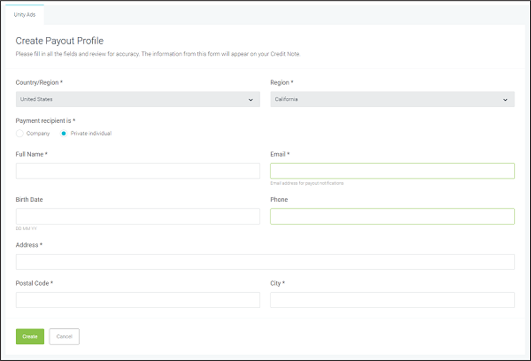

Your profile information is now saved. You can edit it any time by clicking the **Edit** (pencil icon) button.

#### Adding a payout method
Unity supports Paypal and bank transfers (note that Unity only currently supports local transfers in the US). To add a payout method, navigate to the **Payout Method** section of the **Payout Profile** page, then click the **Edit** or **+ Add payout method** button. 

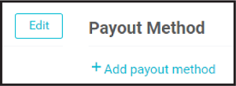

On the **Add Payout Method** page, select an option from the **Payout Method** drop-down menu.

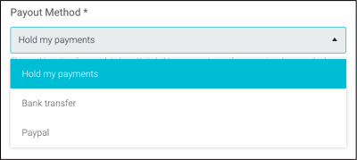

* Select **Hold my payments** to withhold payouts until further notice. When you update this field to one of the other two methods, Unity will pay out all accumulated revenue if it meets the specified [minimum payout amount](#minimum-payout-amount-and-fulfillment).  
* Select **Bank transfer** to set up direct deposits into a specified account (see section on **Bank transfers** below). 
* Select **Paypal** to receive payments directly to your Paypal account (see section on **Paypal** below).

#### Bank transfers
You must provide banking details for the account you want to receive payments. Select **Bank transfer** from the drop-down, then click the **Add bank transfer details** button. 

You will temporarily leave the dashboard to process banking information through our secure partner [Worldpay](https://www.worldpay.com/). 

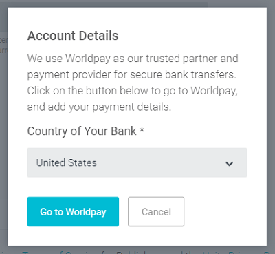

The country of your bank dictates the type of transfer (local or international) and type of information Worldpay requests. 

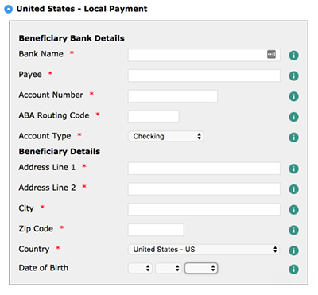

Once you’ve completed the Worldpay form, you will return to the **Add Payout Method** page. 

**Note**: For bank transfers, Unity deducts a transaction fee of 1.5 EUR in the U.S. and 7.5 EUR in all other countries. The intermediate or receiving bank may charge additional fees. If you want receive the payment in any currency other than USD, there will be conversion fees. 

#### PayPal
To set up PayPal deposits, all you need to provide is the minimum payout amount (see section below) and your registered PayPal email address.

**Note**: For every 20,000 USD in revenue paid out through Paypal, Unity deducts a transaction fee of 2% (up to 14 USD in the E.U., and 90 USD outside of the E.U.).

#### Minimum payout amount and fulfillment
Set a minimum amount of accrued earnings for which to receive a payment. Unity processes payments at the end of each month on a net 60 cadence, which means that your outstanding balance is paid in full and received within 60 days of each payment period, so long as your earnings met or exceeded the minimum payout amount. 

For example, if your minimum payment amount is $100, and you earn $200 in the month of March, your total earnings for that period ($200) are paid by the end of May. 

In the same scenario, if you earn $50 in March, then $50 in April, the accumulated balance meets the minimum payment amount and is paid by the end of June.      

#### Finalizing your settings
When you’ve finished specifying your payment method and minimum amount, click the **Create** button to save your selections.

### Revenue transfers
Unity allows you to allocate a portion of your ad revenue into an advertising budget on the [Acquire dashboard](https://acquire.dashboard.unity3d.com/). To set up a revenue transfer:

1. On the [Operate dashboard](https://operate.dashboard.unity3d.com/), select **Finance** from the left navigation bar. 
2. Under **Transaction history**, click **Request transfer**.  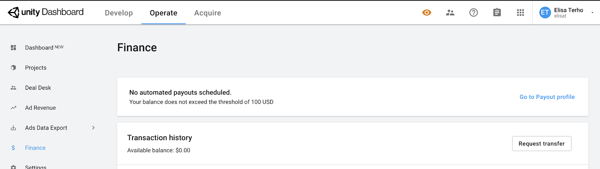
3. In the revenue transfer dialogue, add the amount you want to transfer, then choose the advertiser org you want to transfer to from the dropdown menu.  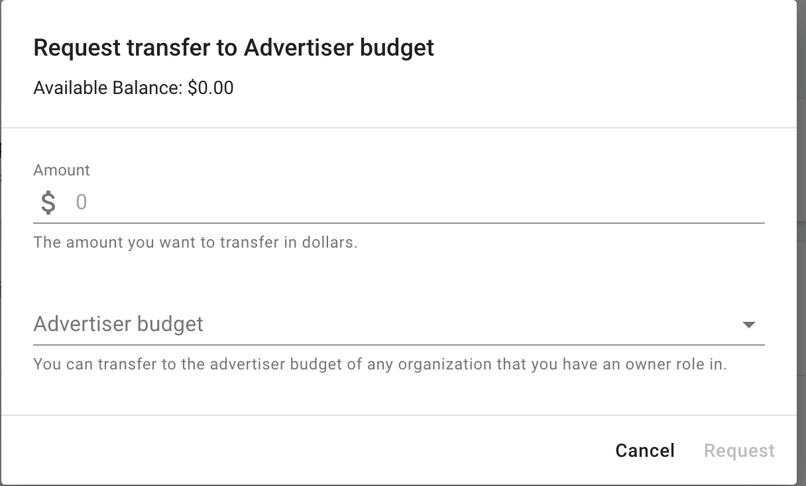 **Important**: You must be the Owner of the publisher Organization to request a revenue transfer. However, you may transfer funds to any Organization you belong to, regardless of role. For more information, see documentation on [managing your Organization](https://docs.unity3d.com/Manual/OrgsManagingyourOrganization.html).  
4. Click **Request**.

The minimum transfer amount is currently 10,000 USD. The maximum transfer amount is limited to the funds available in your payout balance. Transfers may take up to 5 business days to finalize. For questions, please [contact](mailto:unityads-support@unity3d.com) Unity Ads support.

[Learn more](https://blogs.unity3d.com/2020/01/08/7-steps-to-grow-your-game-with-paid-user-acquisition/) about driving user acquisition with Unity advertising.

### Tax information
#### Validation
Unity must collect your relevant tax information in order to withhold taxes when applicable, as required by tax authorities. To validate your tax information, navigate to the **Payout Tax info** section of the **Payout Profile** page, then click the **Create** button. 

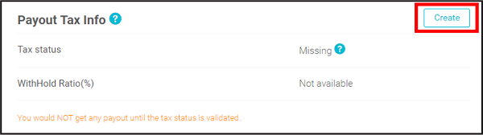

You will temporarily leave the dashboard to complete the tax interview by providing the following information: 
 
* Basic information about yourself 
* Consent to receive information reporting documentation 
* Your overall tax status
* Your electronic signature and consent to use it

When finished, click **Exit interview** to return to the **Payout Profile** page. The **Payout Tax info** section takes a few minutes to update. When it does, the **Tax status** changes to **Validated**.

#### Requesting payment as an individual
Unity can process payment to you as an individual, rather than as a company. To register as a private individual, simply enter your legal name in lieu of a company name. Please be sure that this name also matches an owner of your Unity organization.

In general, no taxes are deducted from payments to companies or similar entities. However, if you are a private individual, payments are governed by tax agreements between your country and Finland. These agreements exist to reduce any possible double taxation and set guidelines for personal taxation rules. Taxes for Ads income are usually between 0-15%, but may be higher for certain countries. Consult your own tax office for further guidance.

Unity will not deduct taxes from your payment. Handling taxes for your revenue is your responsibility.

#### Value Added Tax (VAT) numbers
The European Union (EU) requires members to have a [VAT](https://en.wikipedia.org/wiki/VAT_identification_number) number. The local legislation in each country specifies when you need to apply for a VAT number. If you do not have one, state ”No VAT” or “None” in the corresponding invoice field.

### Transaction history and next estimated payout
You can view an estimate of your next scheduled automated payout on the **Operate** dashboard by selecting **Invoicing** from the left navigation bar.

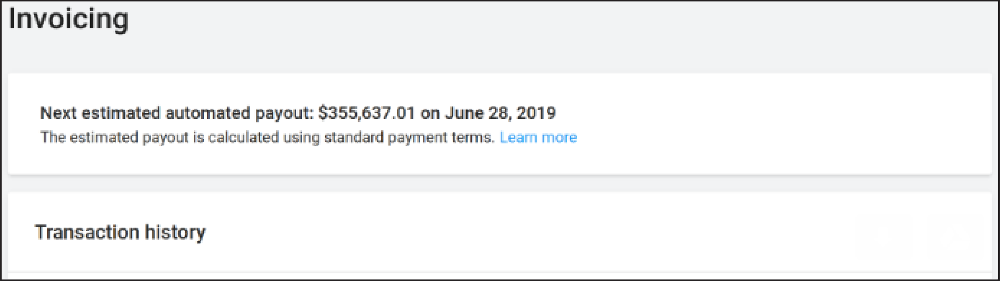

You can also view your transaction history from this page. Alternatively, you can view records of your Unity Ads payouts from the the [Unity ID](https://id.unity.com) portal:

1. Select **Organizations** from the left navigation bar.
2. Select the desired Organization from the list.
3. Select **Transaction History** from the left navigation bar sub-menu.
4. Select the **Payouts** tab.
5. Select the date range you wish to query, then click the **Apply** button to view a list of invoices.

### Making changes to your profile, payout method, or tax info 
You can edit your information at any time from the **Payout Profile** page:

* In the **Payout Profile** section, click the **Edit** button (note that you cannot change the recipient type).
* In the **Payout Method** section, click the **Edit** button.
* In the **Payout Tax** info section, click the **Update** button.

**Note**: Any changes might not affect payouts for the current month. If you need the changes to take effect immediately, or have general issues signing up for automated payouts, please [contact Unity Ads support](mailto:unityads-support@unity3d.com).

## What's next?
Review documentation on [statistics and reporting](MonetizationResourcesStatistics.md) or [rewarded ads best practices](MonetizationResourcesBestPracticesAds.md) to get the most out of your earning potential.