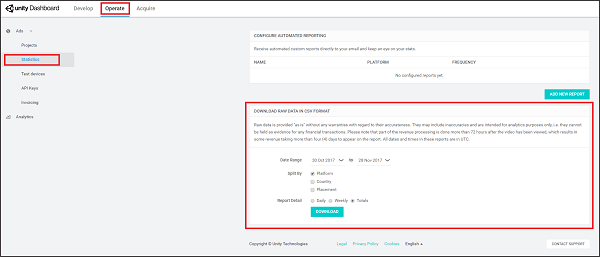
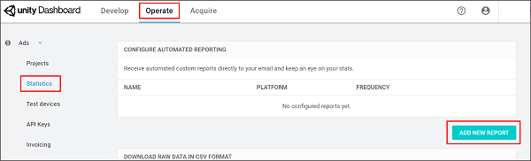
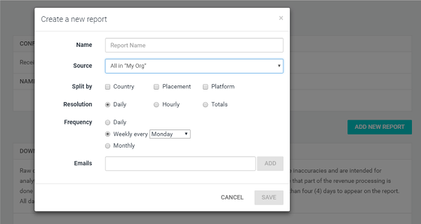

# Monetization Statistics API
## Overview
Unity Ads provides robust reporting tools for analyzing your monetization metrics. There are three reporting methods, outlined below:

* Downloading [raw CSV data](#downloading-raw-csv-data) through the Statistics section of the [developer dashboard](https://operate.dashboard.unity3d.com)
* Configuring [automated reports](#configuring-an-automated-report) through the Statistics section of the [developer dashboard](https://operate.dashboard.unity3d.com)
* Using the Monetization [Stats API](#using-the-monetization-stats-api)

## Downloading raw CSV data
To generate a CSV report for your Organization:

1. From the **Operate** tab of the [developer dashboard](https://operate.dashboard.unity3d.com), select **Statistics** from the left navigation bar.
2. Under the **DOWNLOAD RAW DATA IN CSV FORMAT** section, configure the parameters of your report. Specify the date range, data split (by platform, country, and placement), and granularity of statistics reported.
3. Click the **DOWNLOAD** button.



To generate a CSV report for a specific Project, select your Project from the left navigation bar before following the same steps. For more information on Organization- and Project-level dashboard navigation, read the [dashboard guide](MonetizationResourcesDashboardGuide.md)

## Configuring an automated report
To create automated reports on a specified cadence: 

1. From the **Operate** tab of the [developer dashboard](https://operate.dashboard.unity3d.com), select **Statistics** from the left navigation bar.
2. Under the **CONFIGURE AUTOMATED REPORTING** section, click the **ADD NEW REPORT** button.<br><br>
3. In the configuration prompt, name the report, then set how to split the data (by country, placement, or platform) and how often you want to generate the report. Finally, enter the email addresses (separated by commas) to receive the reports.<br><br>

## Using the Monetization Stats API
The Monetization Stats API allows you to retrieve monetization data directly in CSV format. The API fetches the same statistics that are available on the developer dashboard, however you can use it to programmatically pull data for your own uses.

**Note**: The [Applifier Statistics API](#using-the-applifier-stats-api) is supported, but will be depricated in the future. If you use the Applifier API, Unity recommends [migrating](#migrating-from-the-applifier-api) to the new API.

### Authentication
The endpoint uses an API key from the [Operate dashboard](https://operate.dashboard.unity3d.com/). To find it:

1. From the **Operate** tab of the developer dashboard, select **Ads Data Export** > **API Access** on the left navigation bar.
2. In the **Monetization API Access** section, copy the provided API key, or select **Create api key** if none exists.

You must include the API key as the `"apikey=<token>"` query parameter, or using the authentication header `"Authorization: Token <token>"`.

The redirect URL fetches the data. This is standard HTTP behavior that is supported by all HTTP clients. 

If the authentication fails, the authentication server responds with an `HTTP/2` error code, and a  message in the body. For example:

`400 {"errors":[{"msg":"access token required"}]}`

### Request Format
To retrieve statistics data from the Unity Ads service, use the following [GET request](https://en.wikipedia.org/wiki/Hypertext_Transfer_Protocol#Request_methods), where `organizationId` is the ID of your Unity [Organization](https://docs.unity3d.com/Manual/OrgsUnityOrganizations.html):

```
GET 
https://monetization.api.unity.com/stats/v1/operate/organizations/:organizationId
```

#### Query parameters
The API supports various ways to split your data. Some are required for a successful request. 

**Note**: Some of the following parameters were updated from the [Applifier API](#using-the-applifier-stats-api). To see a list of changes, see the section on [migration](#migrating-from-the-applifier-api).

| **Parameter** | **Description** | **Required** |
| :------------ | :-------------- | :----------- |
| `apikey` | The API authentication key retrieved from the Acquire dashboard. | No (you may use the Authentication header instead) |
| `fields` | A comma-separated list that defines the columns of available fields:<br><br><ul><li>`adrequest_count`</li><li>`start_count`</li><li>`view_count`</li><li>`available_sum`</li><li>`revenue_sum`</li></ul> | Yes |
| `groupBy` | A comma-separated list that expands the rows, splitting data by the following fields:<br><br><ul><li>`placement`</li><li>`country`</li><li>`platform`</li><li>`game` (game ID)</li></ul> | No |
| `scale` | A value that splits data by time resolution. Each day splits at 00:00 UTC. Supported options include:<br><br><ul><li>`hour`</li><li>`day`</li><li>`week`</li><li>`month`</li><li>`year`</li><li>`all`</li></ul> | Yes |
| `start` | The start time of data set, in [ISO 8601](https://en.wikipedia.org/wiki/ISO_8601) format. | Yes |
| `end` | The end time of data set, in [ISO 8601](https://en.wikipedia.org/wiki/ISO_8601) format. | Yes |
| `gameIds` | A comma-separated list of source game IDs by which to filter results.<br><br>**Note**: To obtain source IDs, you can make a request using `groupBy=game`. | No |

This API supports returning CSV or JSON files. Specify the output format in the `"Accept"` header as follows:

*   For CSV, use `"Accept: text/csv"` 
*   For JSON, use `"Accept: application/json"`

Following is an example request, complete with parameters:

```
curl 
https://monetization.api.unity.com/stats/v1/operate/organizations/1234567890abcdefghijkjlmn?groupBy=country,placement,platform,game&fields=adrequest_count,available_sum,revenue_sum,start_count,view_count&scale=hour&start=2019-05-01T00:00:00Z&end=2019-06-12T23:59:00Z&apikey=abcdefghijklmn1234567890 -H "Accept: text/csv" --output stats.csv
```

**Note**: Splitting data across multiple dimensions causes the CSV to grow exponentially, which might cause some large data sets to time-out. The request times out if the server takes more than 60 seconds to process the request.

#### Request status codes
The endpoint returns the following status codes indicating the result of the request:

| **Code** | **Description** |
| :------- | :-------------- |
| `200` | The request succeeded. |
| `400` | The `organizationId`, or another required parameter was omitted from the query. |
| `401` | The API key is missing from the request or invalid. | 
| `404` | Organization not found. |
| `408` | The request timed out. |
| `429` | Request rate limit exceeded. |
| `500` | The request failed for an unknown reason. |
| `503` | The service is unavailable. |

### Migrating from the Applifier API
Many changes from the [Applifier API](#using-the-applifier-stats-api) are not backwards compatible. However, they are not time consuming, and only require minor modifications. The following section highlights those changes, and guidance on how to adapt to the new API.

The following main differences apply:

* The endpoint URL
* The API key
* Using Organization IDs instead of Developer IDs
* Query parameters

#### Endpoint URL
The new API URL is:

`https://monetization.api.unity.com/stats/v1/operate/organizations/:coreOrganizationId` 

`coreOrganizationId` is your **Organization ID** (see section below).

#### API key
The old API uses a legacy API key that is not supported by the new API. The new API key is located in the [Operate dashboard](https://operate.dashboard.unity3d.com/) (see section on [Authentication](#authentication)).

#### Organization ID
The new API requires an Organization ID as part of the URL. To locate it, open the [Operate Dashboard](https://operate.dashboard.unity3d.com/), select **Settings**, and copy the **Organization core ID** field from the **Organization info** section.

#### Changed query parameters
The following table maps parameters from the old API to their equivalents in the new API. These changes apply to CSV column names as well.

The `fields` parameter is the same, however, note that it is now **required**. Omitting it won’t default to `all`, as with the Applifier API. The following parameter options have changed:

| **Applifier API parameter** | **Monetization API equivalent** |
| :-------------------------- | :------------------------------ |
| `adrequests` | `adrequest_count` |
| `available` | `available_sum` |
| `started` | `start_count` |
| `views` | `view_count` |
| `revenue` | `revenue_sum` |
| `platform` | Not supported (use `groupBy`) |
| `all` | Not supported |

The `splitBy` parameter is now `groupBy`. Note that it is now **optional**. Omitting the parameter defaults to `groupBy=none`. The following parameters have changed:

| **Applifier API parameter** | **Monetization API equivalent** |
| :-------------------------- | :------------------------------ |
| `zone` | `placement` |
| Not supported | `platform` |

The `scale` parameter is the same, however, note that it is now **required**. Omitting it won’t default to `day`, as with the Applifier API. The following parameter option has changed:

| **Applifier API parameter** | **Monetization API equivalent** |
| :-------------------------- | :------------------------------ |
| `quarter` | Not supported |

The `start` and `end` parameters are the same. However, while the Applifier API allowed you to define a time frame relative to the current date (for example, `start=7`), that is no longer supported. Both `start` and `end` are now **required** parameters.

The `sourceIDs` parameter represents a source's store-specific ID. Note that this is different from a Game ID, which refers to a source's internal Unity ID.

### Help
For additional questions regarding the Monetization Statistics API, please [contact support](mailto:unityads-support@unity3d.com).

## Using the Applifier Stats API
**Note**: The Applifier API is supported, but will be deprecated in the future. Unity recommends [migrating](#migrating-from-the-applifier-api) to the new API.

The Applifier API works in two stages:

1. The user performs a [`GET` request](https://en.wikipedia.org/wiki/Hypertext_Transfer_Protocol#Request_methods) to an authentication server. After successful authentication, the server responds with a 302 HTTP redirect message, which contains the final URL to the statistics server.
2. When the user performs a `GET` request to the signed URL, the server responds with the requested data in the body of the message in CSV format.

### Authentication
The API uses a key from the Developer Dashboard. To find it:

1. From the [Operate dashboard](https://operate.dashboard.unity3d.com), ensure that you are viewing you Organization dashboard (in other words, no specific Project is selected).
2. Select **Ad Data Export** on the left navigation bar to expand its options, then select **API Access**.

You must include the API Key in the authentication GET request, as the `apikey` parameter.

After successful authentication, the server responds with a 302 HTTP redirect message. Obtain the redirect URL from the `Location` HTTP header.
 
The redirect URL fetches the data. This is standard HTTP behavior that is supported by all HTTP clients. For example, the following request directly outputs the file to the console: 
 
```
curl -L 
"https://gameads-admin.applifier.com/stats/monetization-api?apikey=APIKEY" 
``` 

To retrieve data from the statistics server, you must use a valid URL signature. If the authentication fails, the authentication server responds with an HTTP/1.1 200 OK header, and an error message in the body:
 
```
{"error":"Authentication error","responseCode":500,"status":"error"}
```

### Request Format
The monetization statistics API supports the following request format:

```
https://gameads-admin.applifier.com/stats/monetization-api?apikey=<apikey>&fields=<fields>[&splitBy=<splitbyfields>][&scale=<scale>][&start=<startDate>][&end=<endDate>][&sourceIds=<sourceIds>]
```

For Example:

```
curl -L 
"https://gameads-admin.applifier.com/stats/monetization-api?apikey=a0db664ac99b65cb4h1825e878e06472477dd067752dbeec828cb3b14vb723ee&splitBy=zone,country&fields=adrequests,available,views,revenue&start=2016-01-01&end=2016-10-01&scale=day&sourceIds=1003843" > ~/Desktop/UnityAdsMonetization.csv
```

### Splitting data
To split your data, specify the following parameters:

| **Parameter** | **Description** |
| :------------ | :-------------- |
|`<apikey>`|The API authentication key retrieved from the Developer Dashboard.|
|`<fields>`|A comma-separated list that defines the columns of available fields:<br><br><ul><li>`adrequests`</li> <li>`available`</li> <li>`started`</li> <li>`views`</li> <li>`revenue`</li> <li>`platform`</li> <li>`all`</li></ul><br>**Note**: If you leave the value empty, the parameter defaults to `all`. For detailed descriptions of each metric, see section on [Understanding Unity Ads metrics](#understanding-unity-ads-metrics) below. |
|`<splitbyfields>`|A comma-separated list that expands the rows, splitting data by the following fields:<br><br><ul><li>`source`</li> <li>`zone`</li>	<li>`country`</li></ul><br>**Note**: zone refers to Placement. If you leave the value empty, the parameter defaults to `country`. Use `splitBy=none` if you do not want to split your data.|
|`<scale>`|A value that splits data by time resolution. Each day splits at 00:00 UTC.<br><br><ul><li>`hour`</li> <li>`day`</li> <li>`week`</li> <li>`month`</li> <li>`quarter`</li> <li>`year`</li> <li>`all`</li></ul><br>**Note**: `all` removes time resolution splitting, returning the total values within the specified time period. If you leave the value empty, the parameter defaults to `day`.| 
|`<start>` & `<end>`|The start and end times of each data set.<br><br>**Note**: Negative numbers indicate days relative to the current date (for example, `“start=-7”` denotes 7 days ago). The date string uses [ISO format](https://en.wikipedia.org/wiki/ISO_8601) (for example, `2017-12-17T14:00:00.000Z`). Start and end dates round to the next full hour (for example, `14:00:05.000Z` rounds to `15:00:00.000Z`).|
|`<sourceIds>`|A comma-separated list of Game IDs by which to filter results.<br><br>**Note**: By default, this parameter returns all relevant IDs. For example, `sourceIds=1003843` filters results to only show data associated with this Game ID.| 

**Note**: Splitting data across multiple dimensions causes the CSV to grow exponentially, which might cause some large data sets to time-out. The request times out if the server takes more than 60 seconds to process the request.

For additional questions regarding the Applifier API, please [contact support](mailto:unityads-support@unity3d.com).

## Understanding Unity Ads metrics
### Terminology
#### Ad request
The game client makes an ad request to the Unity Ads network during SDK initialization. If an ad is available, the ad caches and the server tallies a received request. When a player views the cached ad, the game client sends a new request.

#### Ad start (see also, Impressions)
An ad start counts when a video begins playing. This is more commonly called an impression. The quality of impressions generated by your game dictates how much revenue you earn.

#### Available
An available ad refers to a successful response to an ad request.

#### eCPM (effective Cost Per Mille)
eCPM is the average revenue your game earns per 1000 impressions. This value depends on the bids of the ads shown in your game and their overall performance; you can think of it as a general representation of how valuable your ad space is to advertisers. 

#### Fill rate
Fill rate is the rate of available ads served divided by the number of ad requests. Unity Ads generally has a 95%+ fill rate, though several factors such as region and player base may mitigate this.

Unity Ads has a global fill rate of greater than 95%, but some regions outside of America and Europe that might have smaller ad pools won't always have ads available. It's important to check whether ads are available before showing ads to your users.

For more tips on maximizing impressions, read the [ads best practices guide](MonetizationResourcesBestPracticesAds.md). If you are interested in further restricting the maximum number of ads users can view, please contact Unity Ads support. 

#### Impressions (see also, Ad start)
Impressions indicate the number of times an ad is fetched from the server, and tally every time a video begins playing. Impressions earn revenue, however, the quality of impressions vary (see section on interpreting the data, below). 

#### Views
A view counts when a player watches a video ad to completion.

### Interpreting the data
The following section details some useful relationships between data points to consider.

#### Ad requests with no ad starts
Test mode may cause this issue. Check to ensure you’ve disabled it. 

#### Low eCPM
This number reflects a blend of the volume and quality of impressions your game provides; consider reviewing your integration design and marketing strategy. The following user interaction types are listed in escalating order of quality and earning potential:
 
1. Ad start (the player triggers an ad)
2. Completed view (the player watches an ad to the end)
3. Click (the player clicks the ad, leading to an external product link)
4. Install (the player clicks out to the external product page and installs the product) 

Keep this in mind as you consider your monetization strategy. Please review the [ads best practices guide](MonetizationResourcesBestPracticesAds.md) for more integration tips.

#### Low impressions-to-ad requests ratio
A low ad requests ratio can indicate that the Ads SDK is initializing more often than users are viewing ads in your game. An ad request counts when the SDK initializes using your Game ID and requests an ad from the network, which returns an ad for caching. If those ads are never viewed, consider the following tweaks to your integration design: 

* Provide increased or more prominent opportunities for players to view ads.
* Provide stronger incentives for players to opt into rewarded ads. 

Please review our Best practices guide for more integration tips.

#### No ad requests, starts, or views (blank report)
Double-check that the Ads Delivery Service is turned on, and that you’re calling the correct Game ID when initializing Ads.

## What's next?
View documentation on [rewarded ads best practices](MonetizationResourcesBestPracticesAds.md) to get the most out of your implementation.